# 🏗️ 政府专项债项目管理系统 - 完整业务流程

## 🔄 完整业务流程


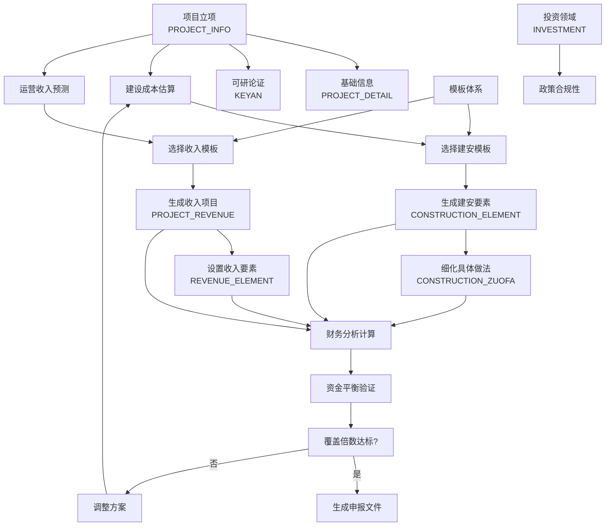

---


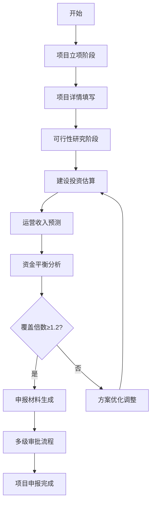

---

## 📋 第一阶段：项目立项

### 1.1 新增项目基本信息 (`project_info`)

**填写字段详细说明**：
#### 🔹 项目基础信息
```sql
-- 核心身份信息
project_name: 'XX市智慧停车场建设项目'          -- 项目全称，用于识别
project_code: 'TCC2025001'                     -- 项目编号，系统自动生成，政府项目唯一标识
project_type: 1                                -- 项目类型：1=新建 2=改扩建 3=技术改造

-- 时间周期
construction_period: 2                         -- 建设期年限，影响资金投放计划
operating_years: 15                            -- 运营期年限，决定收益预测周期
```

##### 关键字解读：
###### 建设期年限 (`construction_period`)

**定义**：项目从**开工建设到竣工验收**所需要的时间

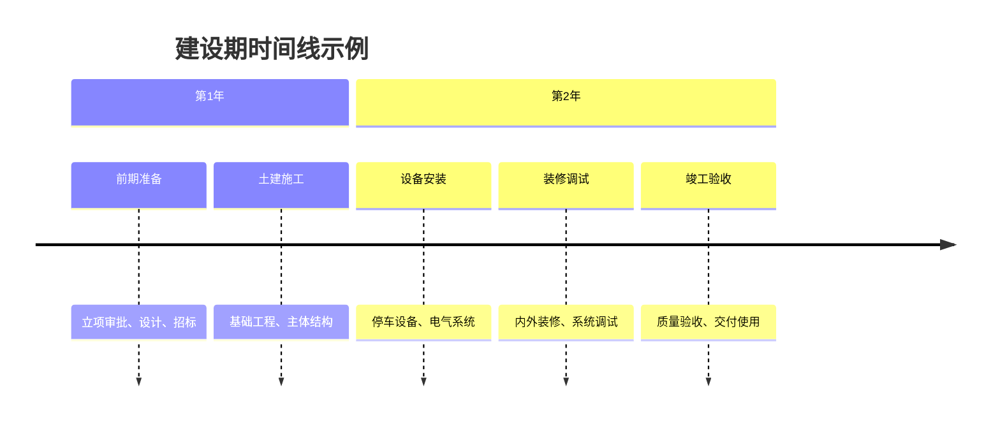

**业务含义**：

- **资金投放期**：在此期间投入建设资金
- **无收入期**：项目尚未运营，没有收入产生
- **成本发生期**：只有支出，没有收益

**实际案例**：

```
-- 智慧停车场项目
construction_period: 2  -- 建设期2年

-- 资金投放计划：
-- 第一年：资本金300万 + 专项债2000万 = 2300万
-- 第二年：资本金200万 + 专项债1500万 = 1700万
-- 总投资：4000万在2年内投放完毕
```


###### 运营期年限 (`operating_years`)

**定义**：项目**建成后开始运营到项目结束**的时间周期

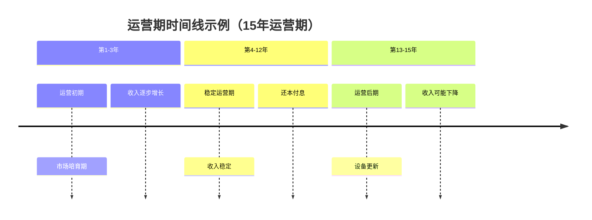

**业务含义**：

- **收益实现期**：项目开始产生运营收入
- **成本回收期**：通过收入回收投资成本
- **债务偿还期**：专项债在本期间偿还

**实际案例**：

```
-- 智慧停车场项目
operating_years: 15  -- 运营期15年

-- 运营收入预测：
-- 第1年：停车费182.5万 + 广告费50万 = 232.5万
-- 第2年：收入增长5%，达到244.1万
-- ...逐年增长...
-- 第15年：预计收入达到约500万
```

###### 完整项目生命周期

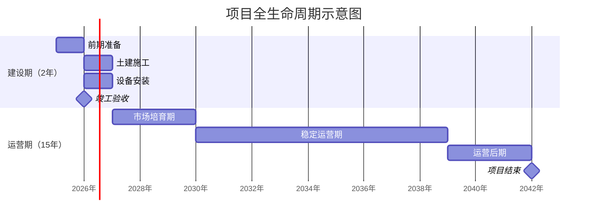


#### 🔹 资金投放计划（分年度）
```sql
-- 第一年资金计划
capital_fund1: 300.00                          -- 第一年资本金投放金额（万元）
special_purpose_bonds1: 2000.00                -- 第一年专项债投放金额（万元）
market_financing1: 0.00                        -- 第一年市场融资金额（万元）

-- 第二年资金计划
capital_fund2: 200.00
special_purpose_bonds2: 1500.00
market_financing2: 0.00

-- 第三至五年资金计划（如有）
capital_fund3: 0.00
special_purpose_bonds3: 0.00
market_financing3: 0.00
```

#### 🔹 融资成本参数
```sql
special_purpose_bonds_ir: 3.50                 -- 专项债年利率（%）
market_financing_ir: 5.00                      -- 市场融资年利率（%）
```

##### 关键词解读：

###### 专项债年利率 (`special_purpose_bonds_ir`)

**定义**：地方政府为项目建设发行专项债券时**向中央政府（地方政府上级）支付的年化利息率**

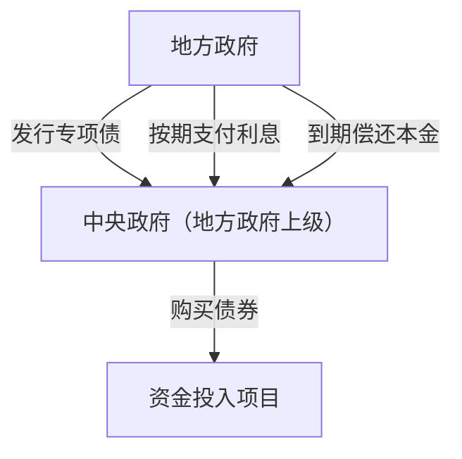

**业务特征**：

🔹 利率水平
```
special_purpose_bonds_ir: 3.50  -- 年利率3.5%

-- 实际利率范围：
-- 一般范围：2.5% - 4.5%
-- 影响因素：债券期限、信用评级、市场利率

```

🔹 政策优势
```
-- 专项债的核心优势
利率较低: '相比市场融资成本更低'
期限较长: '通常10-30年，匹配项目周期'
信用较高: '政府信用背书，风险较低'
```

🔹 计息方式
```
-- 建设期利息处理
建设期利息: '资本化处理，计入项目总投资'
运营期利息: '费用化处理，计入当期财务费用'

-- 实际计算示例
年利息 = 专项债余额 × 专项债年利率
      = 3500万 × 3.5% = 122.5万元
```

**实际业务场景**：
```
-- 智慧停车场项目专项债安排
专项债总额: 3500万元
债券期限: 15年
年利率: 3.5%

-- 利息计算
首年利息 = 3500万 × 3.5% = 122.5万元
-- 随着本金偿还，利息逐年减少
```


###### 市场融资年利率 (`market_financing_ir`)

**定义**：项目单位通过**市场化渠道**融资时**需要支付的年化资金成本**

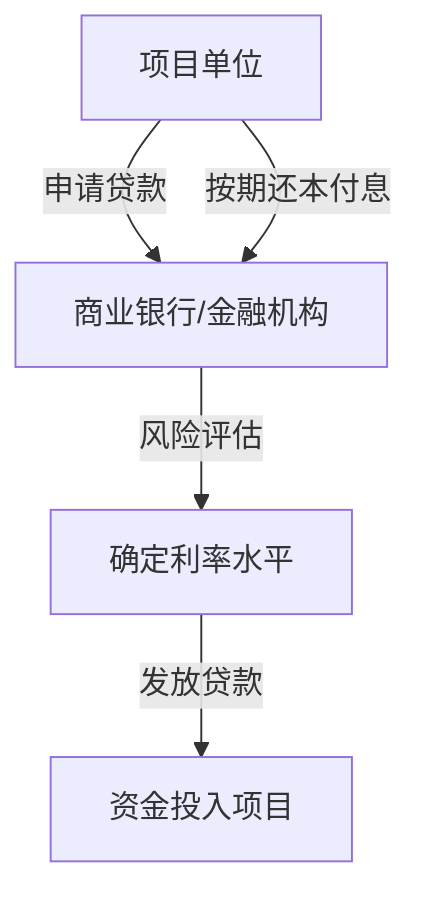

**业务特征**：

🔹 利率水平
```
market_financing_ir: 5.00  -- 年利率5.0%

-- 实际利率范围：
-- 一般范围：4.0% - 8.0%
-- 影响因素：企业信用、担保措施、贷款期限
```

🔹 融资渠道
```
-- 常见的市场融资方式
商业银行贷款: '利率相对较低，审批严格'
信托融资: '利率较高，灵活性好'
融资租赁: '针对设备购置，利率中等'
其他融资: '保理、应收账款融资等'
```

🔹 风险特征
```
-- 相比专项债的差异
信用风险: '依赖项目自身收益能力'
利率风险: '可能随市场波动'
期限匹配: '通常短于专项债期限'
```

**实际业务场景**：
```
-- 智慧停车场项目市场融资安排
市场融资总额: 1000万元
融资期限: 10年
年利率: 5.0%

-- 利息计算
首年利息 = 1000万 × 5.0% = 50万元
-- 通常要求更快的投资回收
```

###### 核心差异对比表

| 对比维度     | 专项债年利率      | 市场融资年利率     |
| -------- | ----------- | ----------- |
| **利率水平** | 2.5% - 4.5% | 4.0% - 8.0% |
| **信用基础** | 政府信用背书      | 项目自身信用      |
| **期限结构** | 10-30年，长期   | 3-10年，中短期   |
| **审批流程** | 政府审批，复杂     | 市场审批，相对灵活   |
| **资金用途** | 严格限定，专项使用   | 相对灵活，用途较广   |
| **风险特征** | 政策风险为主      | 市场风险为主      |

#### 🔹 投资构成汇总
```sql
total_money: 5000.00                           -- 项目总投资额（万元）
ei_fee: 3500.00                                -- 工程费用（建安+设备）
eo_fee: 800.00                                 -- 工程建设其他费用
er_fee: 700.00                                 -- 工程预备费用

-- 资金总额汇总
capital_fund_total: 500.00                     -- 资本金合计
special_purpose_bonds_total: 3500.00           -- 专项债合计
market_financing_total: 1000.00                -- 市场融资合计
```

#### 🔹 运营成本参数
```sql
wages: 60.00                                   -- 工资福利费（万元/年）
manage_money: 40.00                            -- 管理费（万元/年）
maintenance_costs: 30.00                       -- 维修费（万元/年）
```

#### 🔹 审批流程相关
```sql
create_user_id: 101                            -- 项目创建人ID
create_user_name: '张三'                       -- 项目创建人姓名
status: 1                                      -- 项目状态：1=草稿 2=待初审 3=待分配 4=待编写 5=待终审 6=已完成
```

**保存后进入下一步**：项目详情填写

---

## 📝 第二阶段：项目详情填写

### 2.1 填写项目详细信息 (`project_detail`)

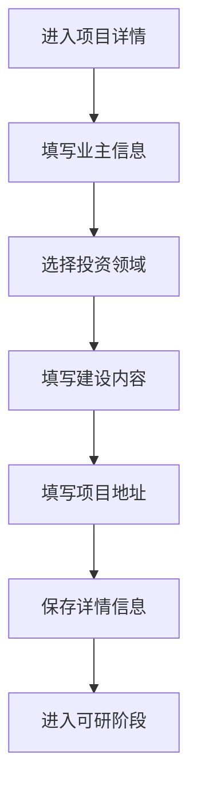

**填写字段详细说明**：

#### 🔹 项目业主信息
```sql
project_owner: 'XX市城市建设投资有限公司'        -- 项目业主单位全称
supervisory_unit: 'XX市住房和城乡建设局'        -- 主管单位
basic_owner_ssid: '91440101MA5XXXXX'          -- 统一社会信用代码
basic_owner_legal: '李四'                      -- 法定代表人
basic_owner_contact: '王五'                    -- 项目联系人
basic_owner_tel: '13800138000'                 -- 联系电话
```

#### 🔹 投资领域分类
```sql
investment_field_a: 1001                       -- 一级投资领域ID（如：市政基础设施）
investment_field_b: 1005                       -- 二级投资领域ID（如：停车场建设）
```

#### 🔹 项目位置信息
```sql
project_city: 101                              -- 项目所在市（行政区划代码）
project_location: 2                            -- 项目区位：1=市区 2=郊区 3=县区
project_address: 'XX市人民路1号'               -- 详细地址
```

#### 🔹 建设时间安排
```sql
construction_type: 1                           -- 建设类型：1=新建 2=改扩建
start_time: '2025-03-01 00:00:00'             -- 计划开工日期
end_time: '2026-12-31 00:00:00'               -- 计划竣工日期
```

#### 🔹 建设内容描述
```sql
construction_content: '新建500个智能停车位，配套充电桩50个、智能停车管理系统1套，总建筑面积10000平方米...'
-- 详细描述项目建设内容，用于可研报告和申报材料
```

#### 🔹 资本金信息
```sql
project_capital_type: '财政资金'               -- 资本金来源类型
business_scope: '停车场建设、运营、管理'        -- 经营范围
```

**保存后进入下一步**：可行性研究

---

## 🔬 第三阶段：可行性研究

### 3.1 编制可行性研究报告 (`keyan`)

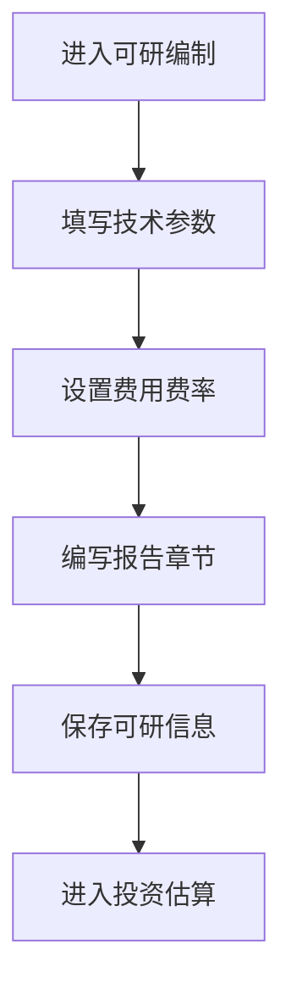

**填写字段详细说明**：


##### 关键字解析：

**可研**全称**可行性研究报告**，是在项目投资决策前进行的**全面技术经济论证**

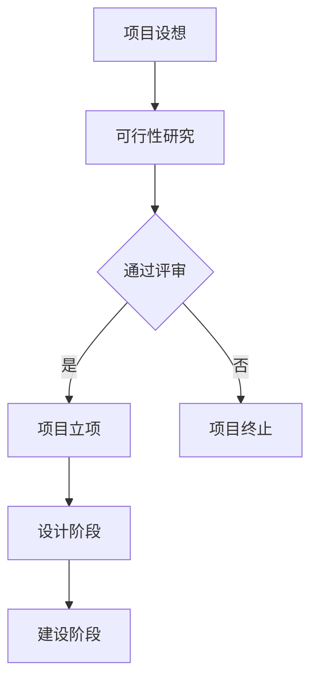


**通俗理解**：

> 就像你打算开一家奶茶店，在投入几十万之前，需要认真研究：
> 
> - 🤔 这个地方适合开奶茶店吗？
> - 💰 需要投资多少钱？
> - 📈 预计能赚多少钱？
> - ⚠️ 可能有什么风险？
> - ✅ 到底值不值得做？

**可研就是回答这些问题的"侦探报告"**

###### 可研编制单位

谁来做这份"侦探报告"？

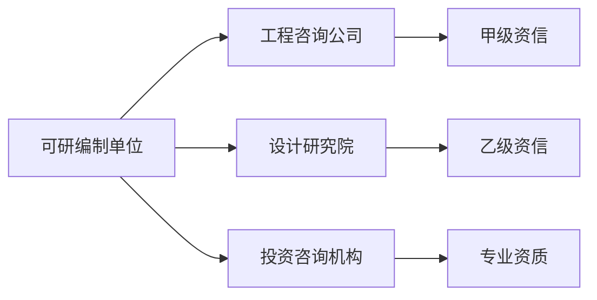

为什么需要专业单位？

🔹 专业能力要求
```
-- 需要多学科专业知识
工程技术: '懂建筑、结构、设备'
经济分析: '会算账、懂财务'
市场研究: '了解行业趋势'
政策法规: '熟悉审批流程'
```

🔹 客观公正要求
```
-- 避免"自己夸自己"
项目单位自己做: '可能夸大收益，隐瞒风险'
第三方专业机构: '相对客观，实事求是'
```

🔹 审批通过要求
```
-- 政府认可的专业性
无资质报告: '政府不认可，无法审批'
有资质报告: '具备法律效力，可作审批依据'
```

###### 一份完整的可研报告结构

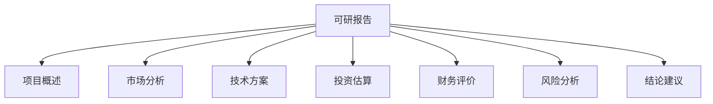


#### 🔹 可研基本信息
```sql
keyan_company: 'XX市工程咨询公司'               -- 可研编制单位
write_user_id: 105                             -- 报告编写人ID
write_user_name: '赵工程师'                    -- 报告编写人姓名
```

#### 🔹 技术规模参数
```sql
total_building_area: 10000.00                  -- 总建筑面积（平方米）
total_land_area: 5.00                          -- 总占地面积（亩）
land_price: 200.00                             -- 征地单价（万元/亩）
```

#### 🔹 费用费率体系
```sql
engineering_other_rate: 8.00                   -- 工程其他费比例（%）
engineering_survey_fee_rate: 0.80              -- 工程勘察费率（%）
engineering_design_fee_rate: 2.50              -- 工程设计费率（%）
engineering_supervision_fee_rate: 2.00         -- 工程监理费率（%）
resettlement_fee_rate: 0.00                    -- 征地拆迁费率（%）
```

#### 🔹 可研报告章节内容
```sql
write_background: '随着XX市机动车保有量快速增长，停车难问题日益突出...'
-- 项目背景与必要性

write_construction_necessity: '项目建设是解决城市停车难问题的迫切需要...'
-- 项目建设必要性

write_technical_scheme: '采用智能停车管理系统，实现无人值守、自动计费...'
-- 技术方案论证

write_financial_rationality: '项目内部收益率8.5%，投资回收期9年...'
-- 财务合理性分析

write_risk_controllability: '主要风险包括建设成本超支、运营收入不及预期...'
-- 风险可控性分析

write_construction_conditions: '项目选址交通便利，市政配套设施完善...'
-- 建设条件分析

write_environmental_impact: '项目建设对环境影响较小，采取相应环保措施...'
-- 环境影响评价

write_energy_saving: '采用节能灯具、智能控制系统，实现能源节约...'
-- 节能措施分析

write_social_stability: '项目建成后将提供就业岗位，改善交通环境...'
-- 社会稳定风险评估

write_other_need: '无其他需要说明的事项'
-- 其他需要说明的事项
```

**保存后进入下一步**：建设投资估算

---

## 🏗️ 第四阶段：建设投资估算

### 4.1 配置建安要素 (`construction_element`)

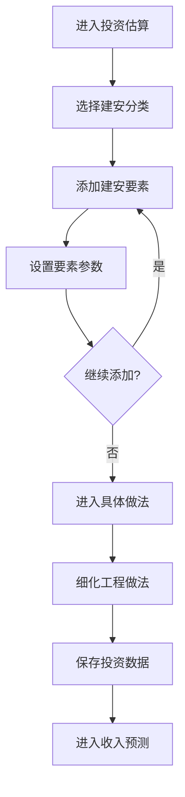

**填写字段详细说明**：

#### 🔹 建安要素配置

```sql
-- 智能停车系统
construction_id: 201                           -- 建安分类ID（智能停车设备）
name: '智能停车管理系统'                       -- 要素名称
num: 1.00                                      -- 数量
unit: '套'                                     -- 单位
price: 1500000.00                              -- 单价（元）
template_id: 1001                              -- 引用模板ID

-- 土建工程
construction_id: 101                           -- 建安分类ID（土建工程）
name: '混凝土浇筑'
num: 5000.00
unit: 'm³'
price: 600.00
template_id: 1002

-- 安装工程
construction_id: 102                           -- 建安分类ID（安装工程）
name: '充电桩安装'
num: 50.00
unit: '个' 
price: 8000.00
template_id: 1003

-- 设备购置
construction_id: 202                           -- 建安分类ID（设备购置）
name: '监控摄像头'
num: 20.00
unit: '个'
price: 3000.00
template_id: 1004
```

### 4.2 细化具体做法 (`construction_zuofa`)

#### 🔹 具体工程做法
```sql
-- 混凝土浇筑做法
construction_element_id: 9021                  -- 关联建安要素ID
name: 'C30商品混凝土'                          -- 材料名称
num: 1.05                                      -- 数量（含5%损耗）
unit: 'm³'                                     -- 单位
price: 550.00                                  -- 单价（元）

-- 钢筋工程做法
construction_element_id: 9022
name: 'HRB400级钢筋'
num: 0.12                                      -- 每立方米混凝土含钢量
unit: '吨'
price: 4800.00

-- 模板工程做法
construction_element_id: 9023
name: '木模板'
num: 8.50                                      -- 模板接触面积
unit: '平方米'
price: 85.00
```

**计算逻辑**：
```
工程费用小计 = ∑(建安要素数量 × 单价)
工程费用总计 = 智能停车系统 + 土建工程 + 安装工程 + 设备购置
           = 150万 + 300万 + 40万 + 6万 = 496万元
```

**保存后进入下一步**：运营收入预测

---

## 💰 第五阶段：运营收入预测

### 5.1 配置收入项目 (`project_revenue`)

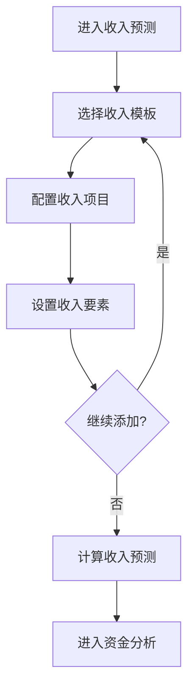

**填写字段详细说明**：

#### 🔹 收入项目配置
```sql
-- 停车费收入
revenue_name: '停车费收入'                      -- 收入项目名称
charging_type: 2                              -- 计费类型：1=按天 2=按月 3=按年
money_type: 2                                 -- 金额单位：1=元 2=万元
output_tax: 6.00                              -- 销项税率（%）
template_id: 201                              -- 收入模板ID

-- 广告收入
revenue_name: '广告位收入'
charging_type: 3                              -- 按年计费
money_type: 2                                 -- 万元
output_tax: 6.00
template_id: 202
```

### 5.2 配置收入要素 (`revenue_element`)

#### 🔹 停车费收入要素
```sql
revenue_id: 7953                              -- 关联收入项目ID
element_name: '日均车流量'                     -- 参数名称
element_value: 400.00                         -- 参数值
element_seq: '1.05,1.08,1.10,1.12,1.15'      -- 年增长率序列（5年）

element_name: '收费标准'
element_value: 5.00                           -- 元/小时
element_seq: '1.03,1.03,1.03,1.03,1.03'      -- 年增长率3%

element_name: '平均停车时长'
element_value: 2.50                           -- 小时
element_seq: '1.00,1.00,1.00,1.00,1.00'      -- 保持不变

element_name: '运营天数'
element_value: 365.00                         -- 天/年
element_seq: '1.00,1.00,1.00,1.00,1.00'      -- 保持不变
```

#### 🔹 广告收入要素
```sql
revenue_id: 7954
element_name: '广告位数量'
element_value: 20.00                          -- 个
element_seq: '1.00,1.00,1.00,1.00,1.00'

element_name: '单个广告位年收入'
element_value: 5.00                           -- 万元/个/年
element_seq: '1.05,1.05,1.05,1.05,1.05'      -- 年增长率5%
```

**收入计算逻辑**：
```
首年停车费收入 = 400辆 × 5元/小时 × 2.5小时 × 365天 ÷ 10000 = 182.5万元
首年广告收入 = 20个 × 5万元/个 = 100万元
首年总收入 = 182.5 + 100 = 282.5万元
```

**保存后进入下一步**：资金平衡分析

---

## ⚖️ 第六阶段：资金平衡分析

### 6.1 自动计算与验证

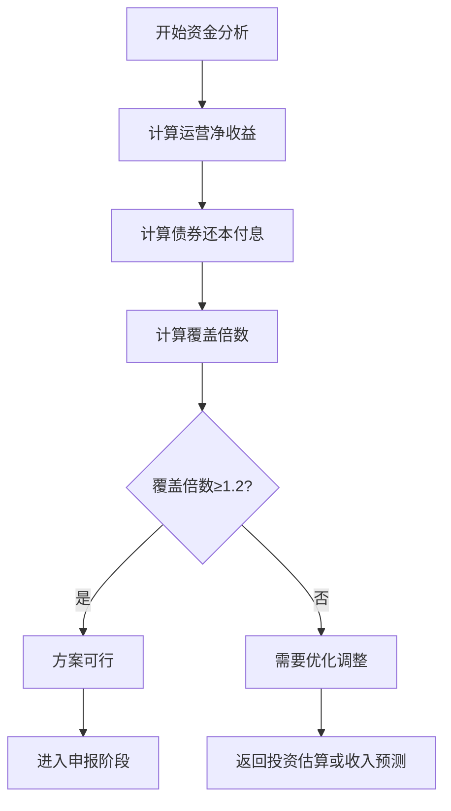

**系统自动计算**：

#### 🔹 运营净收益计算
```sql
-- 系统自动计算
年运营收入 = 停车费收入 + 广告收入 = 282.5万元
年运营成本 = 工资福利 + 管理费 + 维修费 = 60 + 40 + 30 = 130万元
年净收益 = 年运营收入 - 年运营成本 = 282.5 - 130 = 152.5万元
```

#### 🔹 债券还本付息计算
```sql
专项债总额 = special_purpose_bonds1 + special_purpose_bonds2 = 2000 + 1500 = 3500万元
年利息 = 3500 × 3.5% = 122.5万元
年还本 = 3500 ÷ 15 = 233.3万元（按运营期平均偿还）
年还本付息总额 = 122.5 + 233.3 = 355.8万元
```

#### 🔹 覆盖倍数验证
```sql
覆盖倍数 = 年净收益 ÷ 年还本付息额 = 152.5 ÷ 355.8 = 0.43 ❌
-- 不满足≥1.2的要求，需要优化方案
```

### 6.2 方案优化调整

**优化策略选择**：
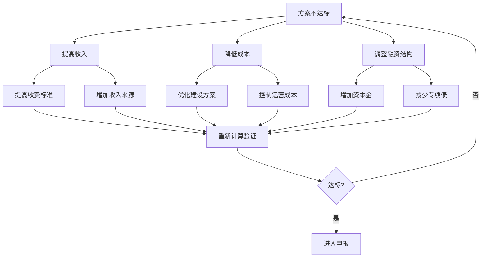

**具体优化操作**：

#### 🔹 提高收入（更新 `revenue_element`）
```sql
-- 提高停车收费标准
UPDATE revenue_element SET 
    element_value = 8.00                       -- 从5元提高到8元/小时
WHERE element_name = '收费标准' AND revenue_id = 7953;

-- 增加广告位数量
INSERT INTO revenue_element (project_id, revenue_id, element_name, element_value, element_seq)
VALUES (1986, 7954, '广告位数量', 30.00, '1.00,1.00,1.00,1.00,1.00');
```

#### 🔹 调整融资结构（更新 `project_info`）
```sql
-- 增加资本金，减少专项债
UPDATE project_info SET
    capital_fund1 = 800.00,                    -- 资本金增加到800万
    capital_fund2 = 700.00,                    -- 资本金增加到700万
    special_purpose_bonds1 = 1500.00,          -- 专项债减少到1500万
    special_purpose_bonds2 = 1000.00,          -- 专项债减少到1000万
    capital_fund_total = 1500.00,              -- 资本金合计1500万
    special_purpose_bonds_total = 2500.00      -- 专项债合计2500万
WHERE id = 1986;
```

**重新验证**：
```
优化后年净收益 = (400×8×2.5×365÷10000 + 30×5) - 130 = 292万元
优化后年还本付息 = 2500 × (3.5% + 1/15) = 212万元
优化后覆盖倍数 = 292 ÷ 212 = 1.38 ✅ 满足要求
```

**验证通过后进入下一步**：申报材料生成

---

## 📑 第七阶段：申报材料生成

### 7.1 生成项目文件 (`project_file`)

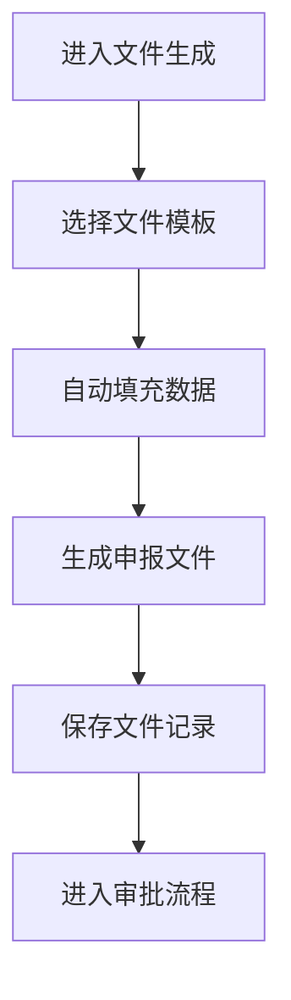

**文件生成操作**：

#### 🔹 可研报告文件
```sql
INSERT INTO project_file (
    project_id,
    file_name,                                -- 'XX市智慧停车场建设项目可行性研究报告'
    file_path,                                -- '/files/1986/keyan_report.pdf'
    file_type,                                -- 4 (可研报告)
    down_name,                                -- '可行性研究报告.pdf'
    file_extension                            -- 'pdf'
);
```

#### 🔹 专项债实施方案
```sql
INSERT INTO project_file (
    project_id, 
    file_name,                                -- '专项债实施方案'
    file_path,                                -- '/files/1986/bond_plan.pdf'
    file_type,                                -- 5 (专项债方案)
    down_name,                                -- '专项债实施方案.pdf'
    file_extension                            -- 'pdf'
);
```

#### 🔹 资金平衡方案
```sql
INSERT INTO project_file (
    project_id,
    file_name,                                -- '项目收益与融资自求平衡方案'
    file_path,                                -- '/files/1986/balance_plan.pdf'
    file_type,                                -- 6 (平衡方案)
    down_name,                                -- '资金平衡方案.pdf'
    file_extension                            -- 'pdf'
);
```

**文件生成后进入下一步**：多级审批流程

---

## ✅ 第八阶段：多级审批流程

### 8.1 审批状态流转

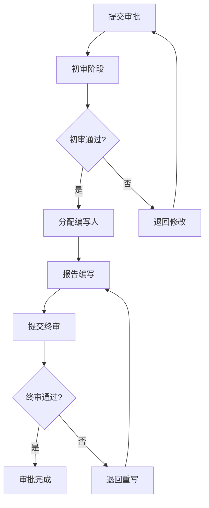

**审批状态更新操作**：

#### 🔹 提交初审
```sql
UPDATE project_info SET
    status = 2,                               -- 状态：2=待初审
    initial_review_user_id = 110,             -- 指定初审人ID
    initial_review_user_name = '孙处长'       -- 初审人姓名
WHERE id = 1986;
```

#### 🔹 初审通过，分配编写人
```sql
UPDATE project_info SET
    status = 3,                               -- 状态：3=待分配
    appoint_user_id = 115,                    -- 指定编写人ID
    appoint_user_name = '钱工程师'            -- 编写人姓名
WHERE id = 1986;
```

#### 🔹 编写完成，提交终审
```sql
UPDATE project_info SET
    status = 4,                               -- 状态：4=待终审
    compile_user_id = 115,                    -- 确认编写人ID
    compile_user_name = '钱工程师'            -- 确认编写人姓名
WHERE id = 1986;
```

#### 🔹 终审通过，项目完成
```sql
UPDATE project_info SET
    status = 5,                               -- 状态：5=已完成
    final_user_id = 120,                      -- 终审人ID
    final_user_name = '周局长',               -- 终审人姓名
    review_comments = '项目方案合理，覆盖倍数达标，同意申报'  -- 审批意见
WHERE id = 1986;
```

---

## 🎉 最终状态：项目申报完成

### 项目最终数据汇总
```
✅ 项目状态：审批通过，准备申报
✅ 总投资：5,000万元
✅ 资金结构：资本金30% + 专项债50% + 市场融资20%
✅ 覆盖倍数：1.38倍（满足≥1.2要求）
✅ 审批流程：创建→初审→分配→编写→终审→完成
✅ 生成文件：可研报告、专项债方案、资金平衡方案
```

这个完整流程涵盖了**政府专项债项目从立项到申报的全过程**，每个阶段都有详细的字段说明和业务逻辑。系统通过这种标准化的流程确保项目**合规、可行、风险可控**。


