# 项目管理数据库表结构分析

## 目录

1. [数据库概览](#数据库概览)
2. [核心业务表结构](#核心业务表结构)
   - [项目相关表组](#1-项目相关表组-project-group)
   - [建安相关表组](#2-建安相关表组-construction-group)
   - [收入相关表组](#3-收入相关表组-revenue-group)
   - [可研相关表组](#4-可研相关表组-research-group)
   - [模板相关表组](#5-模板相关表组-template-group)
   - [系统基础表组](#6-系统基础表组-system-group)
   - [关联表](#7-关联表-association-tables)
   - [字典配置表组](#8-字典配置表组-dictionary-group)
   - [定时任务表组](#9-定时任务表组-quartz-job-group)
   - [日志表组](#10-日志表组-log-group)
   - [代码生成表组](#11-代码生成表组-code-generation-group)
3. [表关系总结图](#表关系总结图)
   - [核心ER图](#核心er图-实体关系图)
   - [系统架构层次图](#系统架构层次图)
   - [核心表关联关系图](#核心表关联关系图)
4. [关键业务逻辑](#关键业务逻辑)
   - [项目创建流程](#1-项目创建流程)
   - [模板使用流程](#2-模板使用流程)
   - [用户权限流程](#3-用户权限流程)
   - [项目审批流程](#4-项目审批流程)
5. [索引建议](#索引建议)
6. [数据完整性说明](#数据完整性说明)
7. [字段类型说明](#字段类型说明)
8. [业务特点总结](#业务特点总结)
9. [附录: 补充图表](#附录-补充图表)
   - [Quartz调度器架构图](#quartz调度器架构图)
   - [数据流转图](#数据流转图)
   - [数据字典关系图](#数据字典关系图)
   - [文件管理关系图](#文件管理关系图)
10. [使用说明](#使用说明)

---

## 数据库概览

数据库名称: `project_manage`
MySQL版本: 8.0.27
表总数: 47张

---

## 核心业务表结构

### 1. 项目相关表组 (Project Group)

#### 1.1 project_info (项目信息表) - 核心主表
- **主键**: `id`
- **关联字段**:
  - `dept_id` → sys_dept.dept_id (部门ID)
  - `contract_id` → 关联合同 (业务关联)
- **用户关联**:
  - `create_user_id`, `initial_review_user_id`, `appoint_user_id`, `compile_user_id`, `final_user_id`, `write_user_id` → sys_user.user_id
- **被关联表**:
  - project_detail
  - project_file
  - project_revenue
  - construction_element
  - revenue_element
  - keyan

#### 1.2 project_detail (项目详情表)
- **主键**: `id`
- **外键关联**:
  - `project_id` → project_info.id
  - `investment_field_a`, `investment_field_b` → investment.id (投向领域A/B)
  - `project_city`, `project_location` → sys_area.id (城市和区位)

#### 1.3 project_file (项目文件表)
- **主键**: `id`
- **外键关联**:
  - `project_id` → project_info.id

#### 1.4 project_revenue (项目收入信息表)
- **主键**: `id`
- **外键关联**:
  - `project_id` → project_info.id
  - `template_id` → revenue_template.id (收入模板)

---

### 2. 建安相关表组 (Construction Group)

#### 2.1 construction_element (项目建安要素表)
- **主键**: `id`
- **外键关联**:
  - `project_id` → project_info.id
  - `construction_id` → construction_info.id (建安ID)
  - `template_id` → construction_element_template.id (模板ID)

#### 2.2 construction_info (建安模板表)
- **主键**: `id`
- **关联字段**:
  - `keyan_id` → keyan.id (可研ID)

#### 2.3 construction_element_template (建安要素模板表)
- **主键**: `id`
- **外键关联**:
  - `construction_template_id` → construction_template.id (二级模板ID)
  - `one_template_id` → level_one_template.id (一级模板ID)

#### 2.4 construction_template (建安模板表)
- **主键**: `id`
- **外键关联**:
  - `level_one_id` → level_one_template.id (一级模板ID)

#### 2.5 construction_zuofa (做法表)
- **主键**: `id`
- **外键关联**:
  - `construction_element_id` → construction_element.id (建安模板ID)

#### 2.6 zuofa (做法表 - 模板)
- **主键**: `id`
- **外键关联**:
  - `construction_element_template_id` → construction_element_template.id (建安模板ID)

---

### 3. 收入相关表组 (Revenue Group)

#### 3.1 revenue_element (收入要素表)
- **主键**: `id`
- **外键关联**:
  - `project_id` → project_info.id
  - `revenue_id` → project_revenue.id (收入信息ID)

#### 3.2 revenue_element_template (收入要素模板表)
- **主键**: `id`
- **外键关联**:
  - `revenue_template_id` → revenue_template.id (模板ID)

#### 3.3 revenue_template (收入模板表)
- **主键**: `id`
- **被关联**: project_revenue, revenue_element_template

---

### 4. 可研相关表组 (Research Group)

#### 4.1 keyan (可研表)
- **主键**: `id`
- **外键关联**:
  - `project_id` → project_info.id
  - `write_user_id` → sys_user.user_id (编写人ID)
- **被关联**: construction_info

---

### 5. 模板相关表组 (Template Group)

#### 5.1 level_one_template (一级模板表)
- **主键**: `id`
- **外键关联**:
  - `investment_field_a`, `investment_field_b` → investment.id (投向领域A/B)
- **被关联**: construction_template, construction_element_template

#### 5.2 expenditure_template (支出模板表)
- **主键**: `id`
- **独立表**: 无直接外键关联

#### 5.3 file_template (文件模板表)
- **主键**: `id`
- **独立表**: 无直接外键关联

---

### 6. 系统基础表组 (System Group)

#### 6.1 sys_user (用户信息表)
- **主键**: `user_id`
- **外键关联**:
  - `dept_id` → sys_dept.dept_id
- **被关联**: project_info (多个用户字段), keyan

#### 6.2 sys_dept (部门表)
- **主键**: `dept_id`
- **自关联**: `parent_id` → sys_dept.dept_id (父部门)
- **被关联**: sys_user, project_info

#### 6.3 sys_role (角色信息表)
- **主键**: `role_id`
- **关联表**: sys_role_menu, sys_role_dept, sys_user_role

#### 6.4 sys_menu (菜单权限表)
- **主键**: `menu_id`
- **自关联**: `parent_id` → sys_menu.menu_id (父菜单)
- **关联表**: sys_role_menu

#### 6.5 sys_area (区域表)
- **主键**: `id`
- **自关联**: `parent_id` → sys_area.id (上级区域)
- **被关联**: project_detail (城市和区位)

#### 6.6 investment (投向领域表)
- **主键**: `id`
- **自关联**: `parent_id` → investment.id (父级ID)
- **被关联**: project_detail, level_one_template

---

### 7. 关联表 (Association Tables)

#### 7.1 sys_user_role (用户角色关联表)
- **复合主键**: (`user_id`, `role_id`)
- **外键**: sys_user.user_id, sys_role.role_id

#### 7.2 sys_role_menu (角色菜单关联表)
- **复合主键**: (`role_id`, `menu_id`)
- **外键**: sys_role.role_id, sys_menu.menu_id

#### 7.3 sys_role_dept (角色部门关联表)
- **复合主键**: (`role_id`, `dept_id`)
- **外键**: sys_role.role_id, sys_dept.dept_id

#### 7.4 sys_user_post (用户岗位关联表)
- **复合主键**: (`user_id`, `post_id`)
- **外键**: sys_user.user_id, sys_post.post_id

---

### 8. 字典配置表组 (Dictionary Group)

#### 8.1 sys_dict_type (字典类型表)
- **主键**: `dict_id`
- **唯一键**: `dict_type`
- **被关联**: sys_dict_data

#### 8.2 sys_dict_data (字典数据表)
- **主键**: `dict_code`
- **外键关联**: `dict_type` → sys_dict_type.dict_type

#### 8.3 sys_config (参数配置表)
- **主键**: `config_id`
- **独立表**

#### 8.4 sys_post (岗位信息表)
- **主键**: `post_id`
- **关联表**: sys_user_post

---

### 9. 定时任务表组 (Quartz Job Group)

#### 9.1 sys_job (定时任务调度表)
- **主键**: `job_id`
- **被关联**: sys_job_log

#### 9.2 sys_job_log (定时任务调度日志表)
- **主键**: `job_log_id`
- **独立表**: 无外键,通过job_name关联

#### 9.3 qrtz_* 系列表 (Quartz调度器表)
- **qrtz_job_details**: 任务详细信息
- **qrtz_triggers**: 触发器详细信息
- **qrtz_cron_triggers**: Cron类型触发器
- **qrtz_simple_triggers**: 简单触发器
- **qrtz_simprop_triggers**: 同步机制行锁
- **qrtz_blob_triggers**: Blob类型触发器
- **qrtz_calendars**: 日历信息
- **qrtz_fired_triggers**: 已触发触发器
- **qrtz_paused_trigger_grps**: 暂停的触发器
- **qrtz_scheduler_state**: 调度器状态
- **qrtz_locks**: 悲观锁信息

**外键约束**:
- qrtz_triggers.job_name → qrtz_job_details.job_name
- qrtz_cron_triggers → qrtz_triggers (trigger_name, trigger_group)
- qrtz_simple_triggers → qrtz_triggers (trigger_name, trigger_group)
- qrtz_simprop_triggers → qrtz_triggers (trigger_name, trigger_group)
- qrtz_blob_triggers → qrtz_triggers (trigger_name, trigger_group)

---

### 10. 日志表组 (Log Group)

#### 10.1 sys_logininfor (系统访问记录表)
- **主键**: `info_id`
- **独立表**: 记录登录日志

#### 10.2 sys_oper_log (操作日志记录表)
- **主键**: `oper_id`
- **独立表**: 记录操作日志

#### 10.3 sys_notice (通知公告表)
- **主键**: `notice_id`
- **独立表**

---

### 11. 代码生成表组 (Code Generation Group)

#### 11.1 gen_table (代码生成业务表)
- **主键**: `table_id`
- **被关联**: gen_table_column

#### 11.2 gen_table_column (代码生成业务表字段)
- **主键**: `column_id`
- **外键关联**: `table_id` → gen_table.table_id

---

## 表关系总结图

### 核心ER图 (实体关系图)

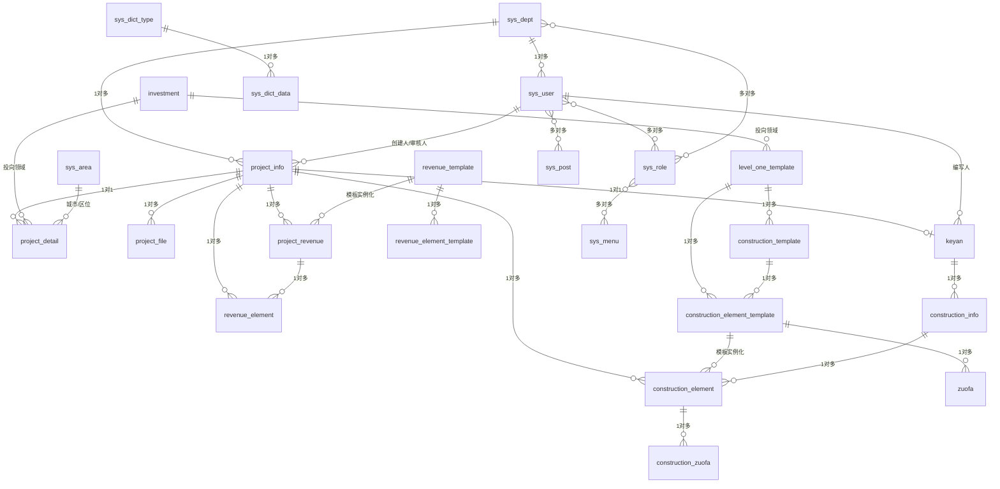

### 系统架构层次图

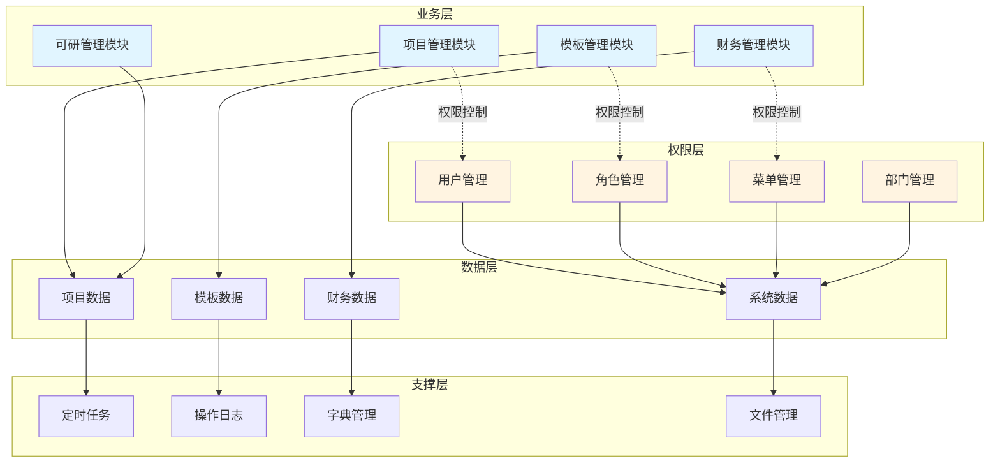

### 核心表关联关系图

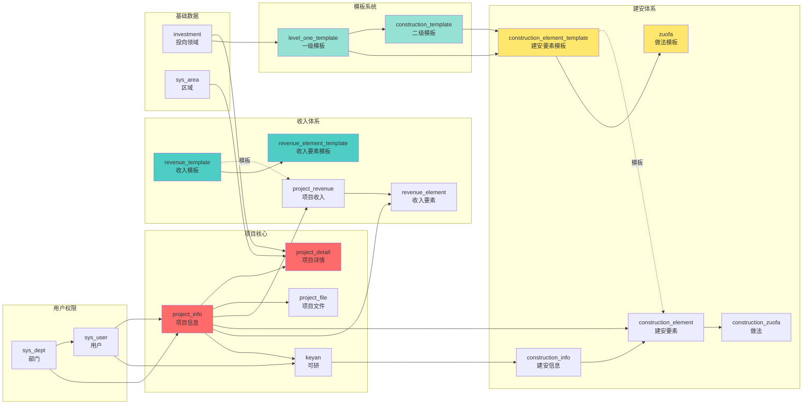

---

## 关键业务逻辑

### 1. 项目创建流程

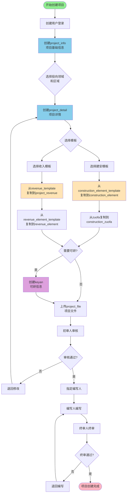

**流程说明**:
1. 创建用户在 `project_info` 创建项目基础信息
2. 在 `project_detail` 添加项目详细信息(关联投向领域`investment`、区域`sys_area`)
3. 根据选择的模板在 `construction_element` 创建建安要素
4. 根据模板在 `project_revenue` 创建收入信息
5. 在 `revenue_element` 创建收入要素明细
6. 可选: 创建 `keyan` 可研信息
7. 上传项目文件到 `project_file`
8. 经过多级审批流程(初审→指定→编写→终审)

### 2. 模板使用流程

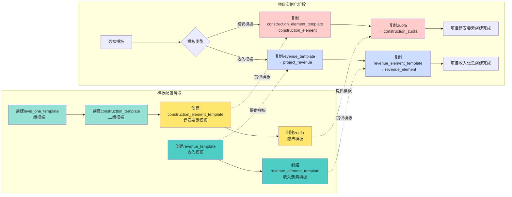

**流程说明**:
1. **模板配置**: 先创建模板层级结构
   - 一级模板 → 二级模板 → 建安要素模板 → 做法模板
   - 收入模板 → 收入要素模板
2. **项目实例化**: 从模板复制到项目实例
   - `construction_element_template` → `construction_element`
   - `zuofa` → `construction_zuofa`
   - `revenue_template` → `project_revenue`
   - `revenue_element_template` → `revenue_element`

### 3. 用户权限流程

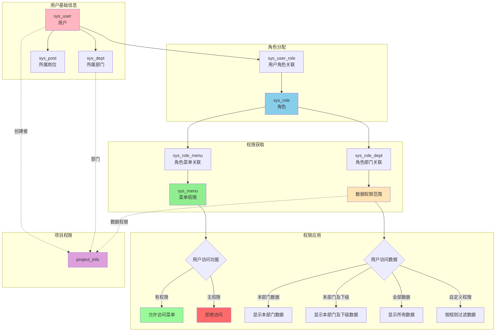

**流程说明**:
1. **用户基础**: `sys_user` 属于 `sys_dept` (部门) 和 `sys_post` (岗位)
2. **角色分配**: 通过 `sys_user_role` 关联到 `sys_role`
3. **菜单权限**: 通过 `sys_role_menu` 获取 `sys_menu` 菜单权限
4. **数据权限**: 通过 `sys_role_dept` 设置数据权限范围
   - 全部数据权限(1)
   - 自定义数据权限(2)
   - 本部门数据权限(3)
   - 本部门及以下数据权限(4)
5. **项目访问**: 结合用户、部门、数据权限控制项目访问范围

### 4. 项目审批流程

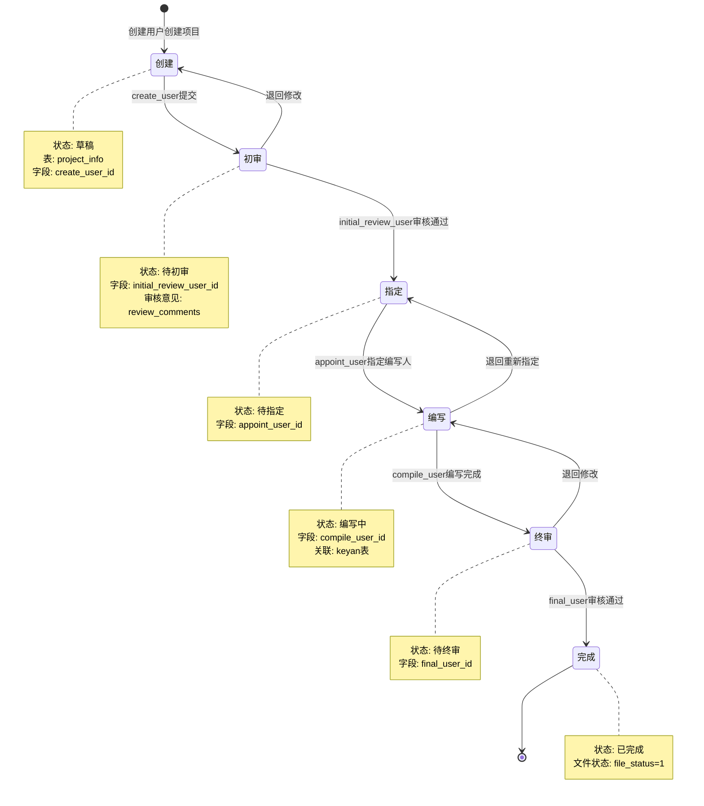

---

## 索引建议

当前数据库索引情况:
- 所有主键都有索引
- `sys_logininfor`: status, login_time 有索引
- `sys_oper_log`: business_type, status, oper_time 有索引
- `sys_dict_type`: dict_type 有唯一索引

**建议添加的索引**:
1. `project_info.dept_id` - 按部门查询项目
2. `project_info.status` - 按状态筛选项目
3. `project_detail.project_id` - 加速关联查询
4. `construction_element.project_id` - 加速关联查询
5. `project_revenue.project_id` - 加速关联查询
6. `revenue_element.revenue_id` - 加速关联查询
7. `sys_user.dept_id` - 加速用户部门查询

---

## 数据完整性说明

### 已有外键约束
- Quartz 调度器相关表之间有外键约束
- 其他业务表主要通过应用层维护关联关系

### 级联删除风险
由于大部分表没有外键约束,删除操作需要在应用层处理:
1. 删除项目时需要同步删除: project_detail, project_file, project_revenue, construction_element, revenue_element
2. 删除用户时需要检查: project_info 中的各个用户ID字段
3. 删除部门时需要检查: sys_user, project_info

---

## 字段类型说明

### 金额字段
- 主要使用 `decimal(20,2)` - 支持大额金额,精确到分
- 部分使用 `decimal(10,2)` - 中等金额

### 文本字段
- `varchar(255)` - 一般文本
- `varchar(2000)` - 长文本
- `text` - 超长文本内容
- `longblob` - 二进制大对象(如公告内容)

### 状态字段
- 统一使用 `int` 或 `char(1)`
- 0通常表示正常/启用, 1表示停用/失败

---

## 业务特点总结

1. **模板驱动**: 系统采用模板+实例的设计模式,先配置模板,再基于模板创建项目实例
2. **多级审批**: 项目有创建人、初审人、指定人、编写人、终审人等多个角色参与
3. **财务计算**: 涉及大量财务指标计算(资本金、专项债、市场融资等)
4. **文件管理**: 项目关联文件管理功能
5. **权限控制**: 完整的RBAC权限体系(用户-角色-菜单-部门)
6. **数据字典**: 使用字典表统一管理枚举值
7. **审计日志**: 完整的登录日志、操作日志记录

---

## 附录: 补充图表

### Quartz调度器架构图

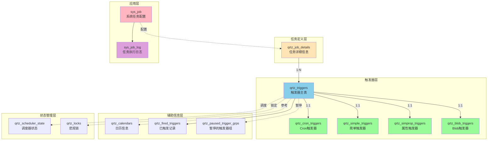

### 数据流转图

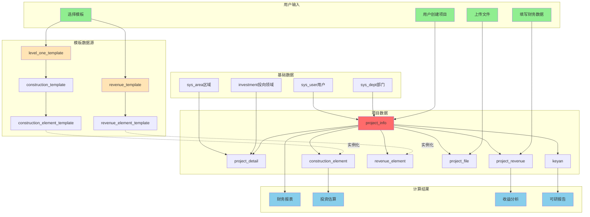

### 数据字典关系图

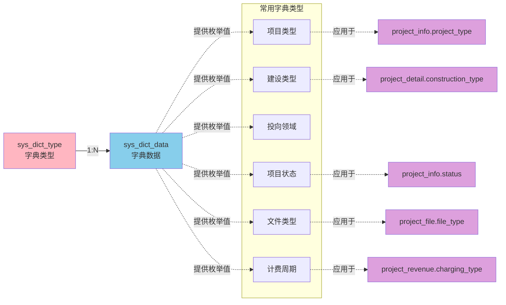

### 文件管理关系图

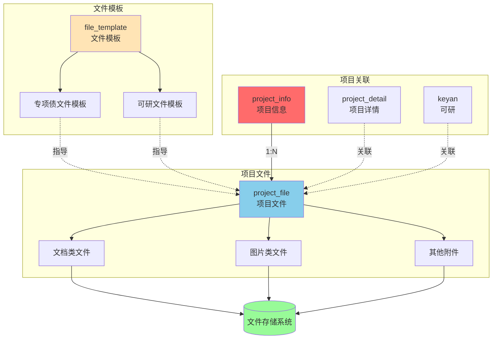

---

## 使用说明

### 如何阅读ER图
- `||--o{` 表示一对多关系
- `||--o|` 表示一对一关系
- `}o--o{` 表示多对多关系
- `-.->` 表示虚线关系(逻辑关联,无强制外键)

### 如何阅读流程图
- 矩形框 `[]` 表示处理步骤
- 菱形框 `{}` 表示判断/决策
- 圆角框 `([])` 表示开始/结束
- 实线箭头 `-->` 表示流程方向
- 虚线箭头 `-.->` 表示参考/引用关系

### 颜色说明
- **红色系** (#FF6B6B, #FFB6C1): 核心业务表(项目相关)
- **蓝色系** (#87CEEB, #4ecdc4): 收入/财务相关
- **黄色系** (#FFE4B5, #ffe66d): 建安/模板相关
- **绿色系** (#90EE90, #95e1d3, #98FB98): 成功/完成状态
- **紫色系** (#DDA0DD): 可研/特殊业务
