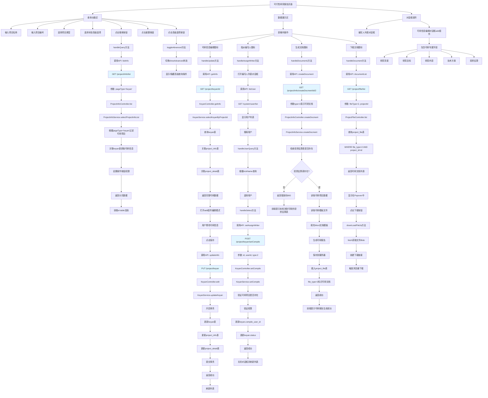
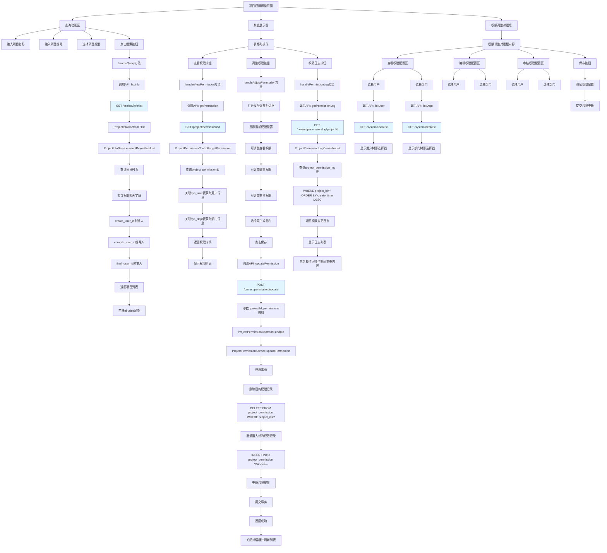
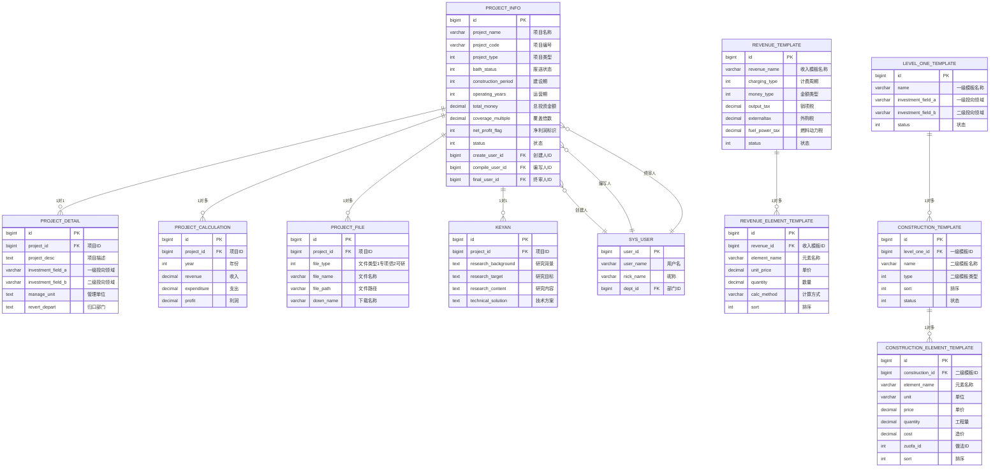

## 一、项目管理 - 专项债项目 (`/views/project/info/index.vue`)

### 1.1 前端功能

#### **页面主要功能：**
- **查询功能**：支持按项目名称、项目编号、项目类型、报送状态、建设期、运营期、状态、创建人、编写人、终审人等多维度查询
- **列表展示**：显示项目编号、报送状态、录入人、编写人、项目名称、覆盖倍数、净利润、总投资金额等信息
- **操作功能**：
  - 查看/审核项目
  - 获取覆盖倍数（调用getFgbs接口）
  - 修改项目信息
  - 指派编写人
  - 生成文档
  - 下载文档
  - 批量更新测算表

#### **前端请求流程：**

**1. 查询列表**
```javascript
// 前端调用 (index.vue line 565)
listInfo(queryParamsWithType)
  -> /project/info/list (GET请求)
  -> 参数包含: pageType='zxz', pageNum, pageSize, 查询条件...
```

**2. 指派编写人**
```javascript
// 前端调用 (index.vue line 601)
setAssignWriter(projectNo, id, userId, type)
  -> /project/info/setCompile (POST请求)
  -> 参数: { projectCode, id, compileUserId, type:1 }
```

**3. 生成文档**
```javascript
// 前端调用 (index.vue line 853)
createDocument(projectId, "1")
  -> /project/info/createDocment/{id}/1 (GET请求)
```

**4. 更新报送状态**
```javascript
// 前端调用 (index.vue line 537)
updatebathStatus({id, bathStatus})
  -> /project/info/updatebathStatus (POST请求)
```

### 1.2 后端处理 (`ProjectInfoController.java`)

#### **Controller层接口：**

**1. 查询列表** (`line 49`)
```java
@GetMapping("/list")
public TableDataInfo list(ProjectInfo projectInfo)
```
- 调用Service: `projectInfoService.selectProjectInfoList(projectInfo)`
- 返回分页数据

**2. 获取详情** (`line 76`)
```java
@GetMapping("/{id}")
public AjaxResult getInfo(@PathVariable("id") Long id)
```
- 调用Service: `projectInfoService.selectProjectInfoById(id)`
- 返回单个项目详细信息

**3. 生成文档** (`line 84`)
```java
@GetMapping("/createDocment/{id}/{type}")
public AjaxResult createDocment(@PathVariable("id") Long id, @PathVariable("type") Integer type)
```
- 调用Service: `projectInfoService.createDocment(id, type, 4000)`
- type=1表示专项债文档
- 返回生成结果，如果没有投资估算表则返回错误码800

**4. 指派编写人** (`line 189`)
```java
@PostMapping("/setCompile")
public AjaxResult setCompile(@RequestBody SetCompileDto setCompileDto)
```
- 调用Service: `projectInfoService.setCompile(setCompileDto)`
- 验证测算表是否存在
- 更新编写人信息和项目状态

### 1.3 Service层处理 (`ProjectInfoServiceImpl.java`)

Service层主要完成业务逻辑处理：

**1. 查询列表业务逻辑：**
- 根据pageType区分专项债(zxz)和可研(keyan)
- 根据用户权限过滤数据
- 设置操作按钮的权限标识（approve, edit, assign_writer, document）

**2. 指派编写人业务逻辑：**
- 验证测算表是否存在
- 验证项目编号是否匹配
- 更新编写人ID
- 更新项目状态为"编写阶段"
- 记录操作日志

### 1.4 数据库层 (`ProjectInfoMapper.xml`)

通过MyBatis映射文件操作数据库：

**主要表结构：**
- `project_info` - 项目基本信息表
- `project_detail` - 项目详细信息表
- `project_calculation` - 测算表

**关键SQL操作：**
```xml
<select id="selectProjectInfoList">
  SELECT p.*, pd.*, 
         u1.nick_name as createUserName,
         u2.nick_name as compileUserName
  FROM project_info p
  LEFT JOIN project_detail pd ON p.id = pd.project_id
  LEFT JOIN sys_user u1 ON p.create_user_id = u1.user_id
  LEFT JOIN sys_user u2 ON p.compile_user_id = u2.user_id
  WHERE ...
</select>
```

---

## 二、项目管理 - 可行性研究报告 (`/views/project/keyan/index.vue`)

### 2.1 前端功能

#### **页面主要功能：**
- **查询功能**：按项目名称、项目编号、项目类型、状态查询
- **列表展示**：显示项目编号、编写人、项目名称、总投资金额、建设期、项目类型
- **操作功能**：
  - 可研信息编辑
  - 指派编写人
  - 生成可研文档
  - 下载文档

#### **前端请求流程：**

**1. 查询列表**
```javascript
// 前端调用 (index.vue line 388)
listInfo({ ...queryParams, pageType: 'keyan' })
  -> /project/info/list (GET请求)
  -> 区分pageType来标识这是可研页面
```

**2. 指派编写人**
```javascript
// 前端调用 (index.vue line 419)
setAssignWriter(id, userId, 2)
  -> /project/keyan/setCompile (POST请求)
  -> 参数: { id, compileUserId, type:2 }
```

**3. 生成文档**
```javascript
// 前端调用 (index.vue line 593)
createDocument(projectId, "2")
  -> /project/info/createDocment/{id}/2 (GET请求)
  -> type=2表示可研文档
```

### 2.2 后端处理 (`KeyanController.java`)

#### **Controller层接口：**

**1. 查询列表** (`line 45`)
```java
@GetMapping("/list")
public TableDataInfo list(Keyan keyan)
```
- 调用Service: `keyanService.selectKeyanList(keyan)`
- 分页查询可研项目列表

**2. 获取详情** (`line 70`)
```java
@GetMapping("/{id}")
public AjaxResult getInfo(@PathVariable("id") Long id)
```
- 调用Service: `keyanService.selectKeyanByProjectId(id)`
- 返回可研项目详细信息

**3. 指派编写人** (`line 114`)
```java
@PostMapping("/setCompile")
public AjaxResult setCompile(@RequestBody SetCompileDto setCompileDto)
```
- 调用Service: `keyanService.setCompile(setCompileDto)`
- type=2标识这是可研项目

### 2.3 数据库层

**主要表：**
- `keyan` - 可研项目表（与project_info关联）

---

## 三、项目管理 - 项目权限调整 (`/views/project/adjust/index.vue`)

### 3.1 功能说明

此页面用于调整项目的访问权限和编写权限：

**主要功能：**
- 查看项目列表
- 调整项目的查看权限
- 调整项目的编辑权限
- 指派不同角色（创建人、编写人、终审人）

**权限类型：**
1. **查看权限**：控制哪些用户可以查看项目
2. **编辑权限**：控制哪些用户可以修改项目
3. **审核权限**：控制哪些用户可以审核项目

---

## 四、模板管理 - 收入模板 (`/views/template/revenue/index.vue`)

### 4.1 前端功能

#### **页面主要功能：**
- **查询功能**：按收入模板名称查询
- **列表展示**：显示收入模板名称、计费周期、金额类型、销项税、外购税、燃料动力税、状态
- **操作功能**：
  - 新增收入模板
  - 编辑收入模板
  - 删除收入模板
  - 状态切换（启用/禁用）

#### **前端请求流程：**

**1. 查询列表**
```javascript
// 前端调用 (index.vue line 239)
listRevenue(queryParams)
  -> /template/revenue/list (GET请求)
  -> 参数: { pageNum, pageSize, revenueName }
```

**2. 新增模板**
```javascript
// add组件中调用
addRevenue(form)
  -> /template/revenue (POST请求)
  -> 参数: { revenueName, chargingType, moneyType, outputTax, externaltax, fuelPowerTax, status }
```

**3. 修改模板**
```javascript
// add组件中调用
updateRevenue(form)
  -> /template/revenue (PUT请求)
  -> 参数: 同新增，包含id
```

**4. 删除模板**
```javascript
// 前端调用 (index.vue line 304)
delRevenue(ids)
  -> /template/revenue/{ids} (DELETE请求)
```

### 4.2 后端处理 (`RevenueTemplateController.java`)

#### **Controller层接口：**

**1. 查询列表** (`line 44`)
```java
@GetMapping("/list")
public TableDataInfo list(RevenueTemplate revenueTemplate)
```
- 调用Service: `revenueTemplateService.selectRevenueTemplateList(revenueTemplate)`

**2. 新增** (`line 90`)
```java
@PostMapping
public AjaxResult add(@RequestBody RevenueTemplateDto revenueTemplateDto)
```
- 调用Service: `revenueTemplateService.insertRevenueTemplate(revenueTemplateDto)`

**3. 修改** (`line 101`)
```java
@PutMapping
public AjaxResult edit(@RequestBody RevenueTemplateDto revenueTemplateDto)
```
- 调用Service: `revenueTemplateService.updateRevenueTemplate(revenueTemplateDto)`

**4. 删除** (`line 112`)
```java
@DeleteMapping("/{ids}")
public AjaxResult remove(@PathVariable Long[] ids)
```
- 调用Service: `revenueTemplateService.deleteRevenueTemplateByIds(ids)`

### 4.3 数据库层

**主要表：**
- `revenue_template` - 收入模板主表
- `revenue_element_template` - 收入模板元素表（明细）

**字段说明：**
- `revenue_name` - 收入模板名称
- `charging_type` - 计费周期（字典：project_calc_period）
- `money_type` - 金额类型（字典：project_calc_unit）
- `output_tax` - 销项税率
- `externaltax` - 外购税率
- `fuel_power_tax` - 燃料动力税率
- `status` - 状态（0停用 1启用）

---

## 五、模板管理 - 可研建安模板 (`/views/template/construction/index.vue`)

### 5.1 前端功能

#### **页面主要功能：**
- **查询功能**：按二级模板名称查询
- **列表展示**：显示一级模板名称、二级模板名称、二级模板类型、排序、状态
- **操作功能**：
  - 新增建安模板
  - 编辑建安模板
  - 复制建安模板
  - 删除建安模板
  - 点击二级模板名称进入三级元素管理

#### **前端请求流程：**

**1. 查询列表**
```javascript
// 前端调用 (index.vue line 261)
listConstruction(queryParams)
  -> /template/construction/list (GET请求)
  -> 参数: { pageNum, pageSize, levelOneId, name }
```

**2. 新增模板**
```javascript
// add组件中调用
addConstruction(form)
  -> /template/construction (POST请求)
  -> 参数: { levelOneId, name, type, sort, status }
```

**3. 复制模板** (`line 346`)
```javascript
copyConstruction(sourceId, oneTemplateId)
  -> /template/construction/copy/{sourceId}/{oneTemplateId} (DELETE请求)
```
- 复制一个建安模板到另一个一级模板下

### 5.2 后端处理 (`ConstructionTemplateController.java`)

#### **Controller层接口：**

**1. 查询列表** (`line 46`)
```java
@GetMapping("/list")
public TableDataInfo list(ConstructionTemplate constructionTemplate)
```

**2. 根据一级模板ID查询** (`line 54`)
```java
@GetMapping("/listByOneTemplateId/{id}")
public AjaxResult listByOneTemplateId(@PathVariable("id") Long id)
```

**3. 新增** (`line 108`)
```java
@PostMapping
public AjaxResult add(@RequestBody ConstructionTemplateDto constructionTemplateDto)
```

**4. 复制** (`line 141`)
```java
@DeleteMapping("copy/{sourceId}/{oneTemplateId}")
public AjaxResult copy(@PathVariable("sourceId") Long sourceId, 
                       @PathVariable("oneTemplateId") Long oneTemplateId)
```
- 将sourceId的建安模板复制到oneTemplateId下

### 5.3 数据库层

**主要表：**
- `level_one_template` - 一级模板表（总模板）
- `construction_template` - 建安模板二级表
- `construction_element_template` - 建安模板元素表（三级明细）

**关联关系：**
```
level_one_template (一级)
    └── construction_template (二级)
            └── construction_element_template (三级元素)
```

---

## 六、完整数据流转图

### 6.1 查询流程

```
前端 Vue
  ↓ axios.get/post
API层 (/api/xxx.js)
  ↓ request()
后端 Controller
  ↓ @GetMapping/@PostMapping
Service层
  ↓ 业务逻辑处理
Mapper层
  ↓ MyBatis SQL
数据库 MySQL
```

### 6.2 具体示例：查询项目列表

```
1. 前端点击搜索按钮
   views/project/info/index.vue: handleQuery() 
   
2. 调用API方法
   api/project/info.js: listInfo(queryParams)
   发送GET请求: /project/info/list?pageNum=1&pageSize=10&...
   
3. 后端接收请求
   ProjectInfoController.java: 
   @GetMapping("/list")
   list(ProjectInfo projectInfo)
   
4. 调用Service
   ProjectInfoServiceImpl.java:
   selectProjectInfoList(projectInfo)
   - 根据pageType区分专项债/可研
   - 根据用户权限过滤
   - 设置操作按钮权限
   
5. 调用Mapper
   ProjectInfoMapper.java:
   selectProjectInfoList(projectInfo)
   
6. 执行SQL
   ProjectInfoMapper.xml:
   <select id="selectProjectInfoList">
     SELECT * FROM project_info 
     LEFT JOIN project_detail ...
     WHERE ...
   </select>
   
7. 返回数据
   数据库 → Mapper → Service → Controller → 前端
   
8. 前端渲染
   el-table显示数据
```

### 6.3 新增/修改流程

```
1. 前端填写表单
   打开对话框 → 填写数据 → 点击提交
   
2. 表单验证
   el-form rules验证
   
3. 发送请求
   POST/PUT请求到后端
   携带表单数据JSON
   
4. 后端接收
   @RequestBody接收JSON
   转换为DTO对象
   
5. Service处理
   - 数据验证
   - 业务逻辑处理
   - 关联数据处理
   - 事务管理
   
6. Mapper操作
   INSERT/UPDATE语句
   
7. 返回结果
   成功: AjaxResult.success()
   失败: AjaxResult.error()
   
8. 前端处理
   成功: 提示消息 → 关闭对话框 → 刷新列表
   失败: 显示错误消息
```

---

## 七、关键技术点

### 7.1 前端技术栈
- **Vue 2.x** - 框架
- **Element UI** - UI组件库
- **Axios** - HTTP请求
- **Vuex** - 状态管理
- **Vue Router** - 路由管理

### 7.2 后端技术栈
- **Spring Boot** - 框架
- **Spring Security** - 权限控制
- **MyBatis** - ORM框架
- **MySQL** - 数据库
- **Hutool** - 工具库

### 7.3 权限控制
```java
// 前端权限指令
v-hasPermi="['project:info:add']"

// 后端权限注解
@PreAuthorize("@ss.hasPermi('project:info:add')")
```

### 7.4 分页处理
```javascript
// 前端分页组件
<pagination
  :total="total"
  :page.sync="queryParams.pageNum"
  :limit.sync="queryParams.pageSize"
  @pagination="getList"
/>

// 后端分页
startPage(); // 开始分页
List<XXX> list = xxxService.selectList(query);
return getDataTable(list); // 返回分页结果
```

---

## 八、数据字典

系统中使用的主要字典类型：

1. **project_type** - 项目类型
   - 1: 普通专项债
   - 2: 组合融资

2. **project_status** - 项目状态
   - 0: 录入阶段
   - 1: 初审阶段
   - 2: 指派阶段
   - 3: 编写阶段
   - 4: 终审阶段
   - 5: 完结阶段
   - -1: 终止

3. **project_bath_status** - 报送状态

4. **project_constr_years** - 建设期

5. **project_operat_years** - 运营期

6. **project_calc_period** - 计费周期

7. **project_calc_unit** - 金额类型

---

这就是整个系统从前端到后端再到数据库的完整流程分析。每个功能模块都遵循相同的架构模式：**前端Vue组件 → API接口 → Controller → Service → Mapper → 数据库**。


## 1. 项目管理 - 专项债项目 (index.vue)

```mermaid
graph TD
    A[专项债项目页面] --> B[查询功能区]
    A --> C[操作按钮区]
    A --> D[数据展示区]
    A --> E[对话框组件]
    
    B --> B1[输入项目名称]
    B --> B2[输入项目编号]
    B --> B3[选择项目类型]
    B --> B4[选择报送状态]
    B --> B5[选择建设期/运营期]
    B --> B6[选择创建人/编写人/终审人]
    B --> B7[点击搜索按钮]
    B --> B8[点击重置按钮]
    
    B7 --> B7A[handleQuery方法]
    B7A --> B7B[调用API: listInfo]
    B7B --> B7C[GET /project/info/list]
    B7C --> B7D[ProjectInfoController.list]
    B7D --> B7E[ProjectInfoService.selectProjectInfoList]
    B7E --> B7F[ProjectInfoMapper SQL查询]
    B7F --> B7G[查询project_info表]
    B7G --> B7H[关联project_detail表]
    B7H --> B7I[关联sys_user表获取用户信息]
    B7I --> B7J[根据pageType='zxz'过滤]
    B7J --> B7K[根据用户权限设置操作按钮权限]
    B7K --> B7L[返回分页数据]
    B7L --> B7M[前端el-table渲染]
    
    C --> C1[新增按钮]
    C --> C2[批量更新测算表按钮]
    
    C1 --> C1A[handleAdd方法]
    C1A --> C1B[打开add组件对话框]
    C1B --> C1C[填写项目信息]
    C1C --> C1D[点击保存]
    C1D --> C1E[调用API: addInfo]
    C1E --> C1F[POST /project/info]
    C1F --> C1G[ProjectInfoController.add]
    C1G --> C1H[ProjectInfoService.insertProjectInfo]
    C1H --> C1I[开启事务]
    C1I --> C1J[插入project_info表]
    C1J --> C1K[插入project_detail表]
    C1K --> C1L[插入project_calculation表]
    C1L --> C1M[提交事务]
    C1M --> C1N[返回成功]
    C1N --> C1O[前端提示成功并刷新列表]
    
    C2 --> C2A[handCreateCsb方法]
    C2A --> C2B[确认对话框]
    C2B --> C2C[调用API: createCsb]
    C2C --> C2D[GET /project/info/createCsb/ids]
    C2D --> C2E[ProjectInfoController.createCsb]
    C2E --> C2F[循环处理每个项目ID]
    C2F --> C2G[ProjectInfoService.createCesuanbiao]
    C2G --> C2H[读取项目数据]
    C2H --> C2I[计算测算表数据]
    C2I --> C2J[生成Excel文件]
    C2J --> C2K[保存到服务器]
    C2K --> C2L[更新project_file表]
    C2L --> C2M[返回成功]
    
    D --> D1[表格列操作]
    
    D1 --> D1A[查看按钮]
    D1A --> D1A1[handleView方法]
    D1A1 --> D1A2[调用API: getInfo]
    D1A2 --> D1A3[GET /project/info/id]
    D1A3 --> D1A4[ProjectInfoController.getInfo]
    D1A4 --> D1A5[ProjectInfoService.selectProjectInfoById]
    D1A5 --> D1A6[查询项目详细信息]
    D1A6 --> D1A7[关联查询明细数据]
    D1A7 --> D1A8[返回完整项目数据]
    D1A8 --> D1A9[打开add组件只读模式]
    
    D1 --> D1B[获取覆盖倍数按钮]
    D1B --> D1B1[handleGetFgbs方法]
    D1B1 --> D1B2[调用API: getFgbs]
    D1B2 --> D1B3[GET /project/info/getFgbs/id]
    D1B3 --> D1B4[ProjectInfoController.getFgbs]
    D1B4 --> D1B5[ProjectInfoService.getFgbs]
    D1B5 --> D1B6[读取测算表数据]
    D1B6 --> D1B7[计算覆盖倍数]
    D1B7 --> D1B8[更新project_info.coverage_multiple]
    D1B8 --> D1B9[返回成功]
    D1B9 --> D1B10[刷新列表显示新的覆盖倍数]
    
    D1 --> D1C[修改按钮]
    D1C --> D1C1[handleUpdate方法]
    D1C1 --> D1C2[调用API: getInfo]
    D1C2 --> D1C3[GET /project/info/id]
    D1C3 --> D1C4[获取投资领域信息]
    D1C4 --> D1C5[调用API: getInvestmentInfo]
    D1C5 --> D1C6[GET /system/investment/id]
    D1C6 --> D1C7[获取管理单位和归口部门列表]
    D1C7 --> D1C8[打开add组件编辑模式]
    D1C8 --> D1C9[用户修改数据]
    D1C9 --> D1C10[点击保存]
    D1C10 --> D1C11[调用API: updateInfo]
    D1C11 --> D1C12[PUT /project/info]
    D1C12 --> D1C13[ProjectInfoController.edit]
    D1C13 --> D1C14[ProjectInfoService.updateProjectInfo]
    D1C14 --> D1C15[更新project_info表]
    D1C15 --> D1C16[更新project_detail表]
    D1C16 --> D1C17[更新project_calculation表]
    D1C17 --> D1C18[返回成功]
    D1C18 --> D1C19[刷新列表]
    
    D1 --> D1D[指派编写人按钮]
    D1D --> D1D1[handleAssignWriter方法]
    D1D1 --> D1D2[打开编写人列表对话框]
    D1D2 --> D1D3[调用API: listUser获取用户列表]
    D1D3 --> D1D4[GET /system/user/list]
    D1D4 --> D1D5[显示用户列表]
    D1D5 --> D1D6[选择用户并输入项目编号]
    D1D6 --> D1D7[handleSelect方法]
    D1D7 --> D1D8[调用API: setAssignWriter]
    D1D8 --> D1D9[POST /project/info/setCompile]
    D1D9 --> D1D10[参数: projectCode, id, userId, type:1]
    D1D10 --> D1D11[ProjectInfoController.setCompile]
    D1D11 --> D1D12[ProjectInfoService.setCompile]
    D1D12 --> D1D13[验证项目编号是否匹配]
    D1D13 --> D1D14[验证测算表是否存在]
    D1D14 --> D1D15[更新project_info.compile_user_id]
    D1D15 --> D1D16[更新project_info.status为编写阶段]
    D1D16 --> D1D17[返回成功]
    D1D17 --> D1D18[关闭对话框并刷新列表]
    
    D1 --> D1E[生成文档按钮]
    D1E --> D1E1[handleDocument1方法]
    D1E1 --> D1E2[调用API: createDocument]
    D1E2 --> D1E3[GET /project/info/createDocment/id/1]
    D1E3 --> D1E4[参数type=1表示专项债文档]
    D1E4 --> D1E5[ProjectInfoController.createDocment]
    D1E5 --> D1E6[ProjectInfoService.createDocment]
    D1E6 --> D1E7[检查投资估算表是否存在]
    D1E7 --> D1E8[读取项目数据]
    D1E8 --> D1E9[读取模板文件]
    D1E9 --> D1E10[填充Word文档模板]
    D1E10 --> D1E11[生成专项债文档]
    D1E11 --> D1E12[保存到服务器]
    D1E12 --> D1E13[插入project_file表记录]
    D1E13 --> D1E14[返回成功]
    D1E14 --> D1E15[前端提示生成成功]
    
    D1 --> D1F[下载文档按钮]
    D1F --> D1F1[handleDocument方法]
    D1F1 --> D1F2[调用API: documentList]
    D1F2 --> D1F3[GET /project/file/list]
    D1F3 --> D1F4[参数: fileType=1, projectId]
    D1F4 --> D1F5[ProjectFileController.list]
    D1F5 --> D1F6[查询project_file表]
    D1F6 --> D1F7[WHERE file_type=1 AND project_id=id]
    D1F7 --> D1F8[返回文件列表]
    D1F8 --> D1F9[显示在Popover中]
    D1F9 --> D1F10[点击下载按钮]
    D1F10 --> D1F11[downLoadFile2a方法]
    D1F11 --> D1F12[fetch获取文件]
    D1F12 --> D1F13[转换为Blob]
    D1F13 --> D1F14[创建下载链接]
    D1F14 --> D1F15[触发浏览器下载]
    
    D1 --> D1G[报送状态下拉菜单]
    D1G --> D1G1[点击状态标签]
    D1G1 --> D1G2[显示下拉选项]
    D1G2 --> D1G3[选择新状态]
    D1G3 --> D1G4[handleCommand方法]
    D1G4 --> D1G5[调用API: updatebathStatus]
    D1G5 --> D1G6[POST /project/info/updatebathStatus]
    D1G6 --> D1G7[参数: id, bathStatus]
    D1G7 --> D1G8[ProjectInfoController.updatebathStatus]
    D1G8 --> D1G9[ProjectInfoService.updatebathStatus]
    D1G9 --> D1G10[UPDATE project_info SET bath_status=?]
    D1G10 --> D1G11[返回成功]
    D1G11 --> D1G12[刷新列表显示新状态]
    
    E --> E1[编写人列表对话框]
    E --> E2[项目信息编辑对话框add组件]
    
    E2 --> E2A[包含多个Tab页]
    E2A --> E2B[基本信息Tab]
    E2A --> E2C[投资构成Tab]
    E2A --> E2D[收益情况Tab]
    E2A --> E2E[其他信息Tab]
    
    style B7C fill:#e1f5ff
    style C1F fill:#e1f5ff
    style D1A3 fill:#e1f5ff
    style D1B3 fill:#e1f5ff
    style D1C12 fill:#e1f5ff
    style D1D9 fill:#e1f5ff
    style D1E3 fill:#e1f5ff
    style D1F3 fill:#e1f5ff
    style D1G6 fill:#e1f5ff
```



## 2. 项目管理 - 可行性研究报告



## 3. 项目管理 - 项目权限调整




## 4. 模板管理 - 收入模板

```mermaid
graph TD
    A[收入模板页面] --> B[查询功能区]
    A --> C[操作按钮区]
    A --> D[数据展示区]
    A --> E[对话框组件]
    
    B --> B1[输入收入模板名称]
    B --> B2[点击搜索按钮]
    B --> B3[点击重置按钮]
    
    B2 --> B2A[handleQuery方法]
    B2A --> B2B[调用API: listRevenue]
    B2B --> B2C[GET /template/revenue/list]
    B2C --> B2D[参数: pageNum, pageSize, revenueName]
    B2D --> B2E[RevenueTemplateController.list]
    B2E --> B2F[RevenueTemplateService.selectRevenueTemplateList]
    B2F --> B2G[RevenueTemplateMapper.selectRevenueTemplateList]
    B2G --> B2H[SELECT * FROM revenue_template]
    B2H --> B2I[WHERE revenue_name LIKE %?%]
    B2I --> B2J[ORDER BY create_time DESC]
    B2J --> B2K[返回分页数据]
    B2K --> B2L[前端el-table渲染]
    
    B3 --> B3A[resetQuery方法]
    B3A --> B3B[清空查询条件]
    B3B --> B3C[重新调用handleQuery]
    
    C --> C1[新增按钮]
    
    C1 --> C1A[handleAdd方法]
    C1A --> C1B[reset重置表单]
    C1B --> C1C[设置open=true]
    C1C --> C1D[设置title=添加收入模板]
    C1D --> C1E[打开add组件对话框]
    C1E --> C1F[填写收入模板名称]
    C1F --> C1G[选择计费周期dict: project_calc_period]
    C1G --> C1H[选择金额类型dict: project_calc_unit]
    C1H --> C1I[输入销项税率]
    C1I --> C1J[输入外购税率]
    C1J --> C1K[输入燃料动力税率]
    C1K --> C1L[添加收入元素明细]
    C1L --> C1M[点击保存按钮]
    C1M --> C1N[调用API: addRevenue]
    C1N --> C1O[POST /template/revenue]
    C1O --> C1P[请求体: RevenueTemplateDto对象]
    C1P --> C1Q[RevenueTemplateController.add]
    C1Q --> C1R[RevenueTemplateService.insertRevenueTemplate]
    C1R --> C1S[开启事务]
    C1S --> C1T[INSERT INTO revenue_template]
    C1T --> C1U[获取插入的主键ID]
    C1U --> C1V[循环插入收入元素]
    C1V --> C1W[INSERT INTO revenue_element_template]
    C1W --> C1X[设置revenue_id关联主表]
    C1X --> C1Y[提交事务]
    C1Y --> C1Z[返回成功]
    C1Z --> C1AA[前端提示新增成功]
    C1AA --> C1AB[关闭对话框]
    C1AB --> C1AC[刷新列表]
    
    D --> D1[表格列操作]
    
    D1 --> D1A[状态开关]
    D1A --> D1A1[el-switch组件]
    D1A1 --> D1A2[v-model绑定status]
    D1A2 --> D1A3[用户点击切换]
    D1A3 --> D1A4[@change事件触发]
    D1A4 --> D1A5[调用API: updateRevenue]
    D1A5 --> D1A6[PUT /template/revenue]
    D1A6 --> D1A7[参数: id, status]
    D1A7 --> D1A8[RevenueTemplateController.edit]
    D1A8 --> D1A9[RevenueTemplateService.updateRevenueTemplate]
    D1A9 --> D1A10[UPDATE revenue_template SET status=?]
    D1A10 --> D1A11[WHERE id=?]
    D1A11 --> D1A12[返回成功]
    D1A12 --> D1A13[前端更新UI显示]
    
    D1 --> D1B[编辑按钮]
    D1B --> D1B1[handleUpdate方法]
    D1B1 --> D1B2[reset重置表单]
    D1B2 --> D1B3[获取row.id]
    D1B3 --> D1B4[调用API: getRevenue]
    D1B4 --> D1B5[GET /template/revenue/id]
    D1B5 --> D1B6[RevenueTemplateController.getInfo]
    D1B6 --> D1B7[RevenueTemplateService.selectRevenueTemplateById]
    D1B7 --> D1B8[查询revenue_template表]
    D1B8 --> D1B9[LEFT JOIN revenue_element_template]
    D1B9 --> D1B10[返回模板及元素列表]
    D1B10 --> D1B11[form对象赋值]
    D1B11 --> D1B12[设置title=修改收入模板]
    D1B12 --> D1B13[打开add组件编辑模式]
    D1B13 --> D1B14[用户修改数据]
    D1B14 --> D1B15[点击保存]
    D1B15 --> D1B16[调用API: updateRevenue]
    D1B16 --> D1B17[PUT /template/revenue]
    D1B17 --> D1B18[参数: RevenueTemplateDto完整对象]
    D1B18 --> D1B19[RevenueTemplateController.edit]
    D1B19 --> D1B20[RevenueTemplateService.updateRevenueTemplate]
    D1B20 --> D1B21[开启事务]
    D1B21 --> D1B22[UPDATE revenue_template SET ...]
    D1B22 --> D1B23[DELETE FROM revenue_element_template WHERE revenue_id=?]
    D1B23 --> D1B24[批量INSERT新的元素数据]
    D1B24 --> D1B25[提交事务]
    D1B25 --> D1B26[返回成功]
    D1B26 --> D1B27[前端提示修改成功]
    D1B27 --> D1B28[关闭对话框并刷新列表]
    
    D1 --> D1C[删除按钮]
    D1C --> D1C1[handleDelete方法]
    D1C1 --> D1C2[获取row.id]
    D1C2 --> D1C3[弹出确认对话框]
    D1C3 --> D1C4[用户点击确认]
    D1C4 --> D1C5[调用API: delRevenue]
    D1C5 --> D1C6[DELETE /template/revenue/ids]
    D1C6 --> D1C7[RevenueTemplateController.remove]
    D1C7 --> D1C8[RevenueTemplateService.deleteRevenueTemplateByIds]
    D1C8 --> D1C9[开启事务]
    D1C9 --> D1C10[DELETE FROM revenue_element_template]
    D1C10 --> D1C11[WHERE revenue_id IN ids]
    D1C11 --> D1C12[DELETE FROM revenue_template]
    D1C12 --> D1C13[WHERE id IN ids]
    D1C13 --> D1C14[检查是否被项目使用]
    D1C14 --> D1C15{是否被使用?}
    D1C15 -->|是| D1C16[回滚事务]
    D1C16 --> D1C17[返回错误提示]
    D1C17 --> D1C18[前端提示模板已被使用无法删除]
    D1C15 -->|否| D1C19[提交事务]
    D1C19 --> D1C20[返回成功]
    D1C20 --> D1C21[前端提示删除成功]
    D1C21 --> D1C22[刷新列表]
    
    E --> E1[add组件对话框]
    
    E1 --> E1A[基本信息区域]
    E1A --> E1A1[收入模板名称输入框]
    E1A --> E1A2[计费周期下拉选择]
    E1A --> E1A3[金额类型下拉选择]
    E1A --> E1A4[销项税输入框]
    E1A --> E1A5[外购税输入框]
    E1A --> E1A6[燃料动力税输入框]
    
    E1 --> E1B[收入元素区域]
    E1B --> E1B1[收入元素列表表格]
    E1B1 --> E1B2[添加元素按钮]
    E1B2 --> E1B3[填写元素名称]
    E1B3 --> E1B4[填写单价]
    E1B3 --> E1B5[填写数量]
    E1B3 --> E1B6[选择计算方式]
    E1B1 --> E1B7[删除元素按钮]
    E1B1 --> E1B8[排序调整按钮]
    
    E1 --> E1C[底部按钮区]
    E1C --> E1C1[保存按钮]
    E1C --> E1C2[取消按钮]
    
    E1C1 --> E1C1A[表单验证]
    E1C1A --> E1C1B{验证通过?}
    E1C1B -->|否| E1C1C[显示验证错误]
    E1C1B -->|是| E1C1D[判断新增还是修改]
    E1C1D --> E1C1E{form.id是否存在?}
    E1C1E -->|否| E1C1F[调用新增接口]
    E1C1E -->|是| E1C1G[调用修改接口]
    
    E1C2 --> E1C2A[关闭对话框]
    E1C2A --> E1C2B[不刷新列表]
    
    style B2C fill:#e1f5ff
    style C1O fill:#e1f5ff
    style D1A6 fill:#e1f5ff
    style D1B5 fill:#e1f5ff
    style D1B17 fill:#e1f5ff
    style D1C6 fill:#e1f5ff
```

## 5. 模板管理 - 可研建安模板

```mermaid
graph TD
    A[可研建安模板页面] --> B[查询功能区]
    A --> C[操作按钮区]
    A --> D[数据展示区]
    A --> E[对话框组件]
    
    B --> B1[输入二级模板名称]
    B --> B2[点击搜索按钮]
    B --> B3[点击重置按钮]
    
    B2 --> B2A[handleQuery方法]
    B2A --> B2B[调用API: listConstruction]
    B2B --> B2C[GET /template/construction/list]
    B2C --> B2D[参数: pageNum, pageSize, levelOneId, name]
    B2D --> B2E[ConstructionTemplateController.list]
    B2E --> B2F[ConstructionTemplateService.selectConstructionTemplateList]
    B2F --> B2G[ConstructionTemplateMapper.selectList]
    B2G --> B2H[SELECT c.*, o.name as oneName]
    B2H --> B2I[FROM construction_template c]
    B2I --> B2J[LEFT JOIN level_one_template o]
    B2J --> B2K[ON c.level_one_id = o.id]
    B2K --> B2L[WHERE c.name LIKE %?%]
    B2L --> B2M[AND c.level_one_id = ?]
    B2M --> B2N[ORDER BY c.sort ASC]
    B2N --> B2O[返回分页数据]
    B2O --> B2P[前端el-table渲染]
    
    B3 --> B3A[resetQuery方法]
    B3A --> B3B[清空查询条件]
    B3B --> B3C[保留levelOneId]
    B3C --> B3D[重新调用handleQuery]
    
    C --> C1[新增按钮]
    
    C1 --> C1A[handleAdd方法]
    C1A --> C1B[reset重置表单]
    C1B --> C1C[调用API: listOneTemplateAll]
    C1C --> C1D[GET /template/oneTemplate/allList]
    C1D --> C1E[获取所有一级模板列表]
    C1E --> C1F[设置form.levelOneId]
    C1F --> C1G[设置title=添加建安模板]
    C1G --> C1H[打开add组件对话框]
    C1H --> C1I[选择一级模板]
    C1I --> C1J[填写二级模板名称]
    C1J --> C1K[选择二级模板类型dict: construction_install_type]
    C1K --> C1L[填写排序值]
    C1L --> C1M[设置状态启用/禁用]
    C1M --> C1N[添加建安元素明细]
    C1N --> C1O[点击保存按钮]
    C1O --> C1P[调用API: addConstruction]
    C1P --> C1Q[POST /template/construction]
    C1Q --> C1R[请求体: ConstructionTemplateDto对象]
    C1R --> C1S[ConstructionTemplateController.add]
    C1S --> C1T[ConstructionTemplateService.insertConstructionTemplate]
    C1T --> C1U[开启事务]
    C1U --> C1V[INSERT INTO construction_template]
    C1V --> C1W[字段: level_one_id, name, type, sort, status]
    C1W --> C1X[获取插入的主键ID]
    C1X --> C1Y[循环插入建安元素]
    C1Y --> C1Z[INSERT INTO construction_element_template]
    C1Z --> C1AA[字段: construction_id, element_name, unit, price等]
    C1AA --> C1AB[提交事务]
    C1AB --> C1AC[返回成功]
    C1AC --> C1AD[前端提示新增成功]
    C1AD --> C1AE[关闭对话框并刷新列表]
    
    D --> D1[表格列操作]
    
    D1 --> D1A[二级模板名称链接]
    D1A --> D1A1[router-link跳转]
    D1A1 --> D1A2[跳转到: /route/template/constructionElement/index/二级模板ID]
    D1A2 --> D1A3[进入三级元素管理页面]
    D1A3 --> D1A4[显示该二级模板下的所有元素]
    D1A4 --> D1A5[可对元素进行增删改操作]
    
    D1 --> D1B[状态开关]
    D1B --> D1B1[el-switch组件]
    D1B1 --> D1B2[v-model绑定status]
    D1B2 --> D1B3[用户点击切换]
    D1B3 --> D1B4[@change事件触发]
    D1B4 --> D1B5[调用API: updateConstruction]
    D1B5 --> D1B6[PUT /template/construction]
    D1B6 --> D1B7[参数: id, status]
    D1B7 --> D1B8[ConstructionTemplateController.edit]
    D1B8 --> D1B9[ConstructionTemplateService.updateConstructionTemplate]
    D1B9 --> D1B10[UPDATE construction_template SET status=?]
    D1B10 --> D1B11[WHERE id=?]
    D1B11 --> D1B12[返回成功]
    D1B12 --> D1B13[前端更新UI显示]
    
    D1 --> D1C[编辑按钮]
    D1C --> D1C1[handleUpdate方法]
    D1C1 --> D1C2[reset重置表单]
    D1C2 --> D1C3[获取row.id]
    D1C3 --> D1C4[调用API: getConstruction]
    D1C4 --> D1C5[GET /template/construction/id]
    D1C5 --> D1C6[ConstructionTemplateController.getInfo]
    D1C6 --> D1C7[ConstructionTemplateService.selectConstructionTemplateById]
    D1C7 --> D1C8[查询construction_template表]
    D1C8 --> D1C9[LEFT JOIN construction_element_template]
    D1C9 --> D1C10[ON construction_id = construction_template.id]
    D1C10 --> D1C11[返回模板及元素列表]
    D1C11 --> D1C12[form对象赋值]
    D1C12 --> D1C13[设置title=修改建安模板]
    D1C13 --> D1C14[打开add组件编辑模式]
    D1C14 --> D1C15[用户修改数据]
    D1C15 --> D1C16[点击保存]
    D1C16 --> D1C17[调用API: updateConstruction]
    D1C17 --> D1C18[PUT /template/construction]
    D1C18 --> D1C19[参数: ConstructionTemplateDto完整对象]
    D1C19 --> D1C20[ConstructionTemplateController.edit]
    D1C20 --> D1C21[ConstructionTemplateService.updateConstructionTemplate]
    D1C21 --> D1C22[开启事务]
    D1C22 --> D1C23[UPDATE construction_template SET ...]
    D1C23 --> D1C24[DELETE FROM construction_element_template]
    D1C24 --> D1C25[WHERE construction_id=?]
    D1C25 --> D1C26[批量INSERT新的元素数据]
    D1C26 --> D1C27[提交事务]
    D1C27 --> D1C28[返回成功]
    D1C28 --> D1C29[前端提示修改成功]
    D1C29 --> D1C30[关闭对话框并刷新列表]
    
    D1 --> D1D[复制按钮]
    D1D --> D1D1[handleCopy方法]
    D1D1 --> D1D2[保存sourceId = row.id]
    D1D2 --> D1D3[打开建安模板列表对话框]
    D1D3 --> D1D4[调用API: listOneTemplate]
    D1D4 --> D1D5[GET /template/oneTemplate/list]
    D1D5 --> D1D6[显示所有一级模板列表]
    D1D6 --> D1D7[可搜索模板名称]
    D1D7 --> D1D8[handleCopyQuery搜索方法]
    D1D8 --> D1D9[用户选择目标一级模板]
    D1D9 --> D1D10[handleSelect方法]
    D1D10 --> D1D11[调用API: copyConstruction]
    D1D11 --> D1D12[DELETE /template/construction/copy/sourceId/oneTemplateId]
    D1D12 --> D1D13[ConstructionTemplateController.copy]
    D1D13 --> D1D14[ConstructionTemplateService.copy]
    D1D14 --> D1D15[开启事务]
    D1D15 --> D1D16[查询源模板数据]
    D1D16 --> D1D17[SELECT * FROM construction_template WHERE id=sourceId]
    D1D17 --> D1D18[查询源模板元素数据]
    D1D18 --> D1D19[SELECT * FROM construction_element_template WHERE construction_id=sourceId]
    D1D19 --> D1D20[复制模板数据]
    D1D20 --> D1D21[INSERT INTO construction_template]
    D1D21 --> D1D22[设置level_one_id=oneTemplateId]
    D1D22 --> D1D23[设置id=NULL自动生成新ID]
    D1D23 --> D1D24[获取新插入的ID]
    D1D24 --> D1D25[复制元素数据]
    D1D25 --> D1D26[INSERT INTO construction_element_template]
    D1D26 --> D1D27[设置construction_id=新ID]
    D1D27 --> D1D28[提交事务]
    D1D28 --> D1D29[返回成功]
    D1D29 --> D1D30[前端提示复制成功]
    D1D30 --> D1D31[关闭对话框]
    
    D1 --> D1E[删除按钮]
    D1E --> D1E1[handleDelete方法]
    D1E1 --> D1E2[获取row.id]
    D1E2 --> D1E3[弹出确认对话框]
    D1E3 --> D1E4[用户点击确认]
    D1E4 --> D1E5[调用API: delConstruction]
    D1E5 --> D1E6[DELETE /template/construction/ids]
    D1E6 --> D1E7[ConstructionTemplateController.remove]
    D1E7 --> D1E8[ConstructionTemplateService.deleteConstructionTemplateByIds]
    D1E8 --> D1E9[开启事务]
    D1E9 --> D1E10[DELETE FROM construction_element_template]
    D1E10 --> D1E11[WHERE construction_id IN ids]
    D1E11 --> D1E12[DELETE FROM construction_template]
    D1E12 --> D1E13[WHERE id IN ids]
    D1E13 --> D1E14[检查是否被项目使用]
    D1E14 --> D1E15{是否被使用?}
    D1E15 -->|是| D1E16[回滚事务]
    D1E16 --> D1E17[返回错误提示]
    D1E17 --> D1E18[前端提示模板已被使用无法删除]
    D1E15 -->|否| D1E19[提交事务]
    D1E19 --> D1E20[返回成功]
    D1E20 --> D1E21[前端提示删除成功]
    D1E21 --> D1E22[刷新列表]
    
    E --> E1[add组件对话框]
    E --> E2[建安模板列表对话框复制用]
    
    E1 --> E1A[基本信息区域]
    E1A --> E1A1[一级模板下拉选择]
    E1A1 --> E1A1A[显示oneTemplateList]
    E1A1 --> E1A1B[选择后设置levelOneId]
    E1A --> E1A2[二级模板名称输入框]
    E1A --> E1A3[二级模板类型下拉选择]
    E1A3 --> E1A3A[dict: construction_install_type]
    E1A3A --> E1A3B[1-建筑工程]
    E1A3A --> E1A3C[2-安装工程]
    E1A --> E1A4[排序输入框]
    E1A --> E1A5[状态开关]
    
    E1 --> E1B[建安元素区域]
    E1B --> E1B1[元素列表表格]
    E1B1 --> E1B2[添加元素按钮]
    E1B2 --> E1B3[填写元素名称]
    E1B2 --> E1B4[填写单位]
    E1B2 --> E1B5[填写单价]
    E1B2 --> E1B6[填写工程量]
    E1B2 --> E1B7[填写造价]
    E1B2 --> E1B8[选择做法]
    E1B1 --> E1B9[删除元素按钮]
    E1B1 --> E1B10[上移/下移按钮调整排序]
    
    E1 --> E1C[底部按钮区]
    E1C --> E1C1[保存按钮]
    E1C --> E1C2[取消按钮]
    
    E1C1 --> E1C1A[表单验证]
    E1C1A --> E1C1B{验证通过?}
    E1C1B -->|否| E1C1C[显示验证错误]
    E1C1B -->|是| E1C1D[判断新增还是修改]
    E1C1D --> E1C1E{form.id是否存在?}
    E1C1E -->|否| E1C1F[调用新增接口]
    E1C1E -->|是| E1C1G[调用修改接口]
    
    E2 --> E2A[显示一级模板列表]
    E2A --> E2B[搜索框]
    E2B --> E2C[输入模板名称]
    E2C --> E2D[点击搜索]
    E2D --> E2E[过滤显示匹配的模板]
    E2A --> E2F[表格显示]
    E2F --> E2G[建安模板名称]
    E2F --> E2H[一级投向领域]
    E2F --> E2I[二级投向领域]
    E2F --> E2J[选择按钮]
    E2J --> E2K[点击选择]
    E2K --> E2L[执行复制操作]
    
    style B2C fill:#e1f5ff
    style C1Q fill:#e1f5ff
    style D1C5 fill:#e1f5ff
    style D1C18 fill:#e1f5ff
    style D1D12 fill:#e1f5ff
    style D1E6 fill:#e1f5ff
    style D1B6 fill:#e1f5ff
    style D1D5 fill:#e1f5ff
```

## 6. 数据库表关系图



---

以上就是所有5个页面的完整Mermaid流程图。每个流程图都详细展示了：

1. **前端交互流程**：用户操作 → 事件处理 → API调用
2. **后端处理流程**：Controller接收 → Service处理 → Mapper操作
3. **数据库操作**：具体的SQL语句和表关系
4. **数据流转**：数据如何在各层之间传递
5. **业务逻辑**：事务处理、权限验证、数据验证等

你可以直接复制这些Mermaid代码到支持Mermaid的Markdown查看器中查看可视化流程图。