## 一、AOP核心概念

### 1. 什么是AOP？

**AOP（Aspect-Oriented Programming）面向切面编程**，是一种编程范式，用于将横切关注点（Cross-cutting Concerns）从业务逻辑中分离出来。

场景：案例中部分业务方法运行较慢，定位执行耗时较长的方法，此时需要统计每一个业务方法的执行耗时。

**优势：**
1. 减少重复代码
2. 代码无侵入
3. 提高开发效率
4. 维护方便

AOP是一种思想，而在Spring框架中对这种思想进行的实现，要学习的就是Spring AOP。

### 2. 为什么需要AOP？

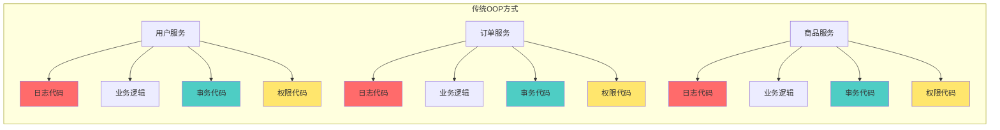

**问题：**
- ❌ 代码重复（日志、事务、权限等代码散落在各处）
- ❌ 代码耦合（业务逻辑与系统服务混在一起）
- ❌ 难以维护（修改一个功能需要改动多处）

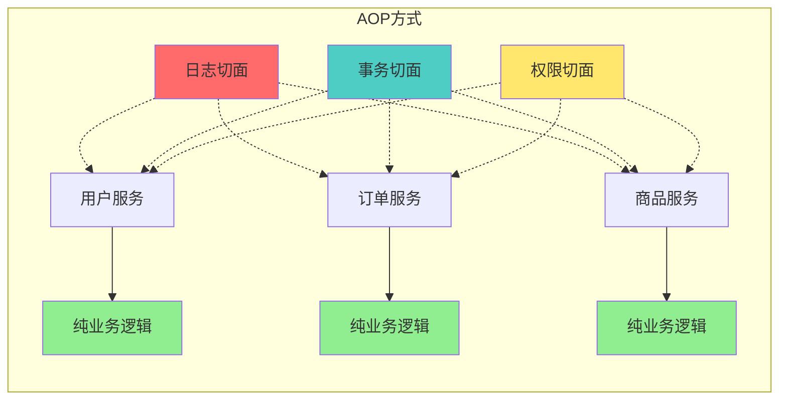

**优势：**
- ✅ 代码复用（切面逻辑统一管理）
- ✅ 解耦合（业务逻辑与系统服务分离）
- ✅ 易维护（修改切面逻辑只需改一处）

---

## 二、AOP核心术语

### 1. 术语对照表

| 术语       | 英文            | 说明            | 举例                                         |
| -------- | ------------- | ------------- | ------------------------------------------ |
| **切面**   | Aspect        | 横切关注点的模块化     | 日志切面、事务切面                                  |
| **连接点**  | Join Point    | 程序执行的某个特定位置   | 方法调用、方法执行                                  |
| **切入点**  | Pointcut      | 匹配连接点的表达式     | `execution(* com.example.service.*.*(..))` |
| **通知**   | Advice        | 切面在特定连接点执行的动作 | 前置通知、后置通知                                  |
| **目标对象** | Target Object | 被代理的对象        | UserService实例                              |
| **织入**   | Weaving       | 将切面应用到目标对象的过程 | 编译期、类加载期、运行期                               |
| **代理**   | Proxy         | AOP创建的对象      | JDK动态代理、CGLIB代理                            |

### 2. 术语关系图

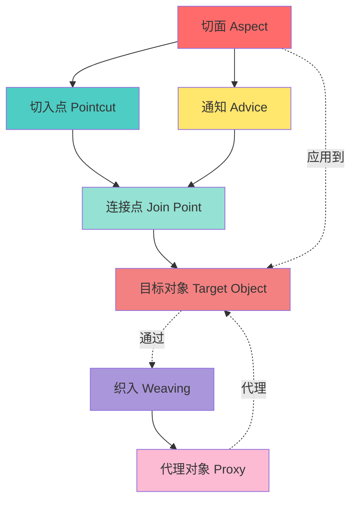

---

## 三、通知类型（Advice Types）

### 1. 五种通知类型

```mermaid
graph TD
    Start([方法调用]) --> Before[前置通知<br/>@Before]
    Before --> Method[目标方法执行]
    Method --> Success{执行成功?}
  
    Success -->|是| AfterReturning[返回通知<br/>@AfterReturning]
    Success -->|否| AfterThrowing[异常通知<br/>@AfterThrowing]
  
    AfterReturning --> After[后置通知<br/>@After]
    AfterThrowing --> After
  
    After --> End([方法结束])
  
    Around[环绕通知<br/>@Around] -.包围.-> Method
  
    style Before fill:#4ECDC4
    style AfterReturning fill:#95E1D3
    style AfterThrowing fill:#FF6B6B
    style After fill:#FFE66D
    style Around fill:#AA96DA
```


**注意1：@Around环绕通知需要自己调用 ProceedingJoinPoint.proceed（）来让原始方法执行，其他通知不需要考虑目标方法执行**

**注意2：@Around环绕通知方法的返回值，必须指定为object，来接收原始方法的返回值。**

### 2. 通知执行顺序

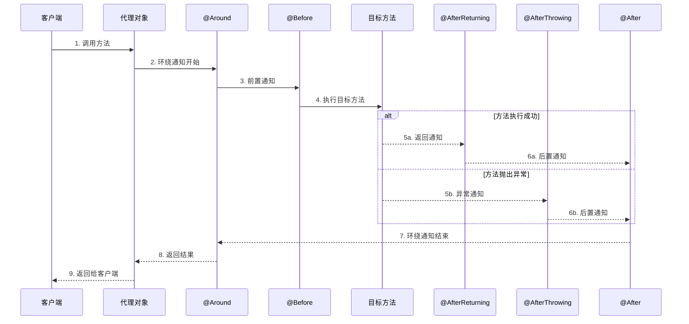


#### 2.1 多个切面的执行顺序 ⭐⭐⭐（重点）

##### 2.1.1. 使用 @Order 指定顺序

```java
@Aspect
@Component
@Order(1)  // 数字越小，优先级越高
public class FirstAspect {
    
    @Before("execution(* com.example.service.*.*(..))")
    public void before() {
        System.out.println("FirstAspect - Before");
    }
    
    @After("execution(* com.example.service.*.*(..))")
    public void after() {
        System.out.println("FirstAspect - After");
    }
    
    @AfterReturning("execution(* com.example.service.*.*(..))")
    public void afterReturning() {
        System.out.println("FirstAspect - AfterReturning");
    }
}

@Aspect
@Component
@Order(2)
public class SecondAspect {
    
    @Before("execution(* com.example.service.*.*(..))")
    public void before() {
        System.out.println("SecondAspect - Before");
    }
    
    @After("execution(* com.example.service.*.*(..))")
    public void after() {
        System.out.println("SecondAspect - After");
    }
    
    @AfterReturning("execution(* com.example.service.*.*(..))")
    public void afterReturning() {
        System.out.println("SecondAspect - AfterReturning");
    }
}

@Aspect
@Component
@Order(3)
public class ThirdAspect {
    
    @Before("execution(* com.example.service.*.*(..))")
    public void before() {
        System.out.println("ThirdAspect - Before");
    }
    
    @After("execution(* com.example.service.*.*(..))")
    public void after() {
        System.out.println("ThirdAspect - After");
    }
    
    @AfterReturning("execution(* com.example.service.*.*(..))")
    public void afterReturning() {
        System.out.println("ThirdAspect - AfterReturning");
    }
}
```

**执行结果：**

```text
FirstAspect - Before      ← Order(1) 最先执行
SecondAspect - Before     ← Order(2)
ThirdAspect - Before      ← Order(3)
目标方法执行
ThirdAspect - After       ← 倒序执行
SecondAspect - After
FirstAspect - After
ThirdAspect - AfterReturning
SecondAspect - AfterReturning
FirstAspect - AfterReturning
```

##### 2.1.2 执行顺序规律（洋葱模型）

```
        @Order(1)
    ┌─────────────────┐
    │   Before(1)     │
    │  ┌──────────────┤
    │  │ @Order(2)    │
    │  │ Before(2)    │
    │  │ ┌────────────┤
    │  │ │ @Order(3)  │
    │  │ │ Before(3)  │
    │  │ │            │
    │  │ │  目标方法   │
    │  │ │            │
    │  │ │ After(3)   │
    │  │ └────────────┤
    │  │ After(2)     │
    │  └──────────────┤
    │   After(1)      │
    └─────────────────┘
```

**记忆口诀：**

```
Before：顺序执行（1→2→3）
After：倒序执行（3→2→1）
就像穿衣服和脱衣服！
```


---

## 四、AOP工作原理

### 1. 代理模式

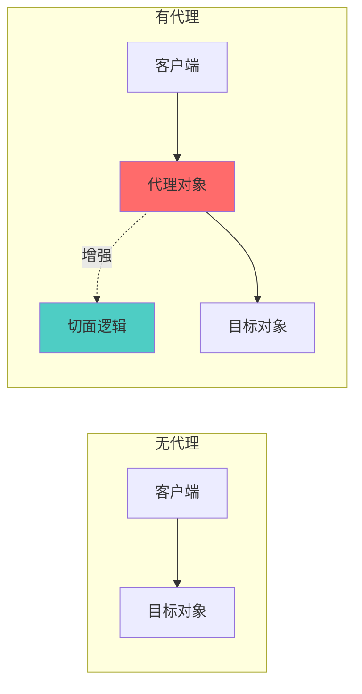

### 2. JDK动态代理 vs CGLIB代理

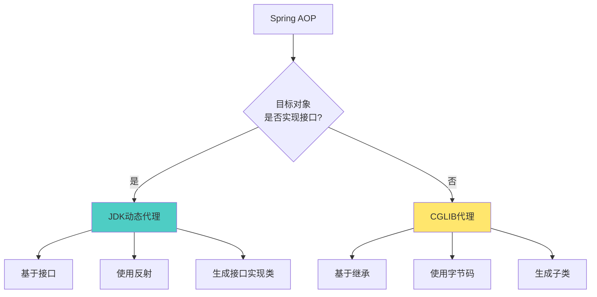

### 3. AOP代理创建流程

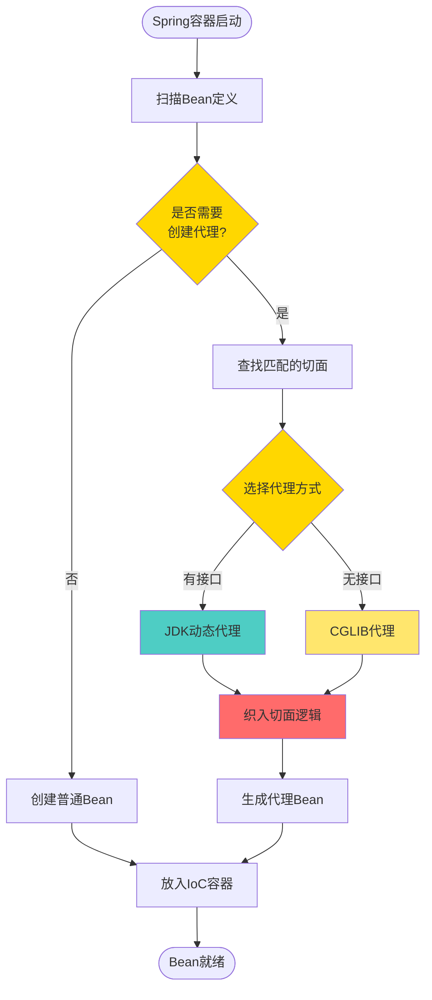

---

## 五、切入点表达式（Pointcut Expression）

### 1. 表达式语法

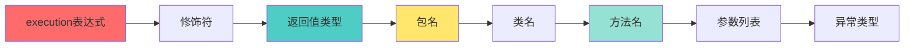

### 2. 常用表达式示例

| 表达式 | 说明 |
|--------|------|
| `execution(* com.example.service.*.*(..))` | service包下所有类的所有方法 |
| `execution(public * com.example.service.UserService.*(..))` | UserService的所有public方法 |
| `execution(* com.example.service..*.*(..))` | service包及子包的所有方法 |
| `execution(* com.example.service.*Service.get*(..))` | 以Service结尾的类的get开头方法 |
| `@annotation(com.example.annotation.Log)` | 带有@Log注解的方法 |
| `within(com.example.service.*)` | service包下的所有连接点 |
| `@within(org.springframework.stereotype.Service)` | 带有@Service注解的类 |

---

## 六.AOP的连接点(Join Point)

### 1. 什么是连接点（Join Point）？

#### 1.1 定义

> **连接点（Join Point）**：程序执行过程中能够插入切面的**具体位置点**。

简单理解：
```
连接点 = 程序执行中可以"插入额外代码"的地方
```

#### 1.2 形象比喻

```
程序执行就像一条流水线：
原材料 → 加工1 → 加工2 → 加工3 → 成品

连接点就是流水线上可以"插入检查员"的位置：
- 加工1之前（检查原材料）
- 加工1之后（检查半成品）
- 加工过程中出错时（处理次品）
- 最终成品完成时（质检）
```

---

### 2. 连接点的类型

#### 在Spring AOP中支持的连接点

| 连接点类型 | 说明 | 示例 |
|-----------|------|------|
| **方法调用** | 调用某个方法时 | `userService.addUser()` |
| **方法执行** | 执行某个方法时 | `addUser()` 方法体内 |
| **构造器调用** | 调用构造函数时 | `new User()` |
| **字段访问** | 访问对象字段时 | `user.name` |
| **字段修改** | 修改对象字段时 | `user.name = "张三"` |
| **异常处理** | 处理异常时 | `catch (Exception e)` |

**⚠️ 注意：Spring AOP只支持方法执行级别的连接点！**

---

### 3. 连接点 vs 切入点 vs 通知

#### 核心概念对比

```java
@Aspect
@Component
public class LogAspect {
  
    // 切入点（Pointcut）：定义规则，匹配哪些连接点
    @Pointcut("execution(* com.example.service.*.*(..))")
    public void serviceLayer() {}
  
    // 通知（Advice）：在连接点执行的代码
    @Before("serviceLayer()")
    public void logBefore(JoinPoint joinPoint) {  // JoinPoint：当前连接点的信息
        System.out.println("方法执行前：" + joinPoint.getSignature());
    }
}
```

#### 关系图解

```
程序中所有可能的位置
    ↓
【连接点（Join Point）】← 所有可以插入代码的点（理论上的所有位置）
    ↓ 通过规则筛选
【切入点（Pointcut）】  ← 实际选中的连接点（符合规则的位置）
    ↓ 在这些点上执行
【通知（Advice）】      ← 要执行的代码（具体做什么）
```

#### 形象比喻

```
连接点 = 全国所有的十字路口（理论上都能装红绿灯）
切入点 = 符合条件的十字路口（车流量大的路口）
通知   = 红绿灯（实际要做的事）
```

---

### 4. JoinPoint 对象详解

#### 1. JoinPoint 接口提供的方法

```java
@Aspect
@Component
public class DetailedAspect {
  
    @Before("execution(* com.example.service.*.*(..))")
    public void beforeMethod(JoinPoint joinPoint) {
      
        // 1. 获取目标方法的签名信息
        Signature signature = joinPoint.getSignature();
        System.out.println("方法签名: " + signature);
        System.out.println("方法名: " + signature.getName());
        System.out.println("声明类型: " + signature.getDeclaringTypeName());
      
        // 2. 获取方法参数
        Object[] args = joinPoint.getArgs();
        System.out.println("参数个数: " + args.length);
        for (int i = 0; i < args.length; i++) {
            System.out.println("参数[" + i + "]: " + args[i]);
        }
      
        // 3. 获取目标对象
        Object target = joinPoint.getTarget();
        System.out.println("目标对象: " + target.getClass().getName());
      
        // 4. 获取代理对象
        Object proxy = joinPoint.getThis();
        System.out.println("代理对象: " + proxy.getClass().getName());
      
        // 5. 获取连接点类型
        String kind = joinPoint.getKind();
        System.out.println("连接点类型: " + kind);
      
        // 6. 获取源码位置（如果可用）
        SourceLocation location = joinPoint.getSourceLocation();
        System.out.println("源码位置: " + location);
    }
}
```

#### 2. 实际输出示例

```java
// 目标方法
public class UserService {
    public void addUser(String name, Integer age) {
        System.out.println("添加用户：" + name + ", " + age);
    }
}

// 调用
userService.addUser("张三", 25);
```

**输出：**
```
方法签名: void com.example.service.UserService.addUser(String,Integer)
方法名: addUser
声明类型: com.example.service.UserService
参数个数: 2
参数[0]: 张三
参数[1]: 25
目标对象: com.example.service.UserService
代理对象: com.example.service.UserService$$EnhancerBySpringCGLIB$$12345678
连接点类型: method-execution
源码位置: UserService.java:15
```

---

### 5. ProceedingJoinPoint（@Around专用）

#### 1. ProceedingJoinPoint vs JoinPoint

```java
// JoinPoint：只能获取信息，不能控制方法执行
@Before("execution(* com.example.service.*.*(..))")
public void before(JoinPoint joinPoint) {
    // 只能读取信息
    System.out.println(joinPoint.getSignature());
    // 不能调用 proceed()
}

// ProceedingJoinPoint：可以控制方法执行
@Around("execution(* com.example.service.*.*(..))")
public Object around(ProceedingJoinPoint pjp) throws Throwable {
    // 可以控制是否执行目标方法
    System.out.println("方法执行前");
    Object result = pjp.proceed();  // 执行目标方法
    System.out.println("方法执行后");
    return result;
}
```

#### 2. ProceedingJoinPoint 的强大功能

```java
@Around("execution(* com.example.service.*.*(..))")
public Object advancedAround(ProceedingJoinPoint pjp) throws Throwable {
  
    // 1. 修改参数
    Object[] args = pjp.getArgs();
    if (args.length > 0 && args[0] instanceof String) {
        args[0] = ((String) args[0]).toUpperCase();  // 参数转大写
    }
  
    // 2. 决定是否执行目标方法
    if (shouldExecute()) {
        // 使用修改后的参数执行
        Object result = pjp.proceed(args);
      
        // 3. 修改返回值
        if (result instanceof String) {
            result = "【已处理】" + result;
        }
      
        return result;
    } else {
        // 不执行目标方法，直接返回
        return "方法被拦截";
    }
}

// 4. 重试机制
@Around("execution(* com.example.service.*.*(..))")
public Object retry(ProceedingJoinPoint pjp) throws Throwable {
    int maxRetries = 3;
    int attempt = 0;
  
    while (attempt < maxRetries) {
        try {
            return pjp.proceed();  // 尝试执行
        } catch (Exception e) {
            attempt++;
            if (attempt >= maxRetries) {
                throw e;  // 重试次数用完，抛出异常
            }
            Thread.sleep(1000);  // 等待1秒后重试
        }
    }
    return null;
}
```

---

### 6. 连接点的实际应用场景

#### 场景1：方法参数日志记录

```java
@Aspect
@Component
@Slf4j
public class ParamLogAspect {
  
    @Before("execution(* com.example.controller.*.*(..))")
    public void logParams(JoinPoint joinPoint) {
        String methodName = joinPoint.getSignature().getName();
        Object[] args = joinPoint.getArgs();
      
        log.info("调用方法: {}", methodName);
        log.info("参数: {}", Arrays.toString(args));
    }
}
```

#### 场景2：敏感信息脱敏

```java
@Around("execution(* com.example.service.*.*(..)) && args(user)")
public Object maskSensitiveInfo(ProceedingJoinPoint pjp, User user) throws Throwable {
    // 执行前：脱敏
    String originalPhone = user.getPhone();
    user.setPhone(maskPhone(originalPhone));
  
    // 执行方法
    Object result = pjp.proceed();
  
    // 执行后：恢复
    user.setPhone(originalPhone);
  
    return result;
}

private String maskPhone(String phone) {
    return phone.replaceAll("(\\d{3})\\d{4}(\\d{4})", "$1****$2");
}
```

#### 场景3：方法执行时间统计

```java
@Around("execution(* com.example.service.*.*(..))")
public Object measureTime(ProceedingJoinPoint pjp) throws Throwable {
    String methodName = pjp.getSignature().toShortString();
  
    long start = System.currentTimeMillis();
    try {
        Object result = pjp.proceed();
        long cost = System.currentTimeMillis() - start;
      
        log.info("方法 {} 执行成功，耗时: {}ms", methodName, cost);
        return result;
    } catch (Exception e) {
        long cost = System.currentTimeMillis() - start;
        log.error("方法 {} 执行失败，耗时: {}ms", methodName, cost);
        throw e;
    }
}
```

#### 场景4：参数校验

```java
@Before("execution(* com.example.service.*.add*(..)) && args(entity)")
public void validateEntity(JoinPoint joinPoint, Object entity) {
    if (entity == null) {
        throw new IllegalArgumentException("实体对象不能为空");
    }
  
    // 使用反射校验必填字段
    Field[] fields = entity.getClass().getDeclaredFields();
    for (Field field : fields) {
        if (field.isAnnotationPresent(NotNull.class)) {
            field.setAccessible(true);
            try {
                if (field.get(entity) == null) {
                    throw new IllegalArgumentException(
                        field.getName() + " 不能为空"
                    );
                }
            } catch (IllegalAccessException e) {
                throw new RuntimeException(e);
            }
        }
    }
}
```

#### 场景5：缓存处理

```java
@Around("@annotation(cacheable)")
public Object cache(ProceedingJoinPoint pjp, Cacheable cacheable) throws Throwable {
    // 生成缓存key
    String key = generateKey(pjp);
  
    // 尝试从缓存获取
    Object cached = cacheManager.get(key);
    if (cached != null) {
        log.info("缓存命中: {}", key);
        return cached;
    }
  
    // 执行方法
    Object result = pjp.proceed();
  
    // 存入缓存
    cacheManager.put(key, result, cacheable.expire());
    log.info("缓存存入: {}", key);
  
    return result;
}

private String generateKey(ProceedingJoinPoint pjp) {
    String className = pjp.getTarget().getClass().getSimpleName();
    String methodName = pjp.getSignature().getName();
    String args = Arrays.toString(pjp.getArgs());
    return className + ":" + methodName + ":" + args;
}
```

---

### 7. 获取连接点的详细信息

#### 完整示例

```java
@Aspect
@Component
@Slf4j
public class DetailedJoinPointAspect {
  
    @Around("execution(* com.example.service.*.*(..))")
    public Object logDetail(ProceedingJoinPoint pjp) throws Throwable {
        // 1. 方法签名信息
        MethodSignature signature = (MethodSignature) pjp.getSignature();
        Method method = signature.getMethod();
      
        log.info("========== 连接点详细信息 ==========");
        log.info("类名: {}", signature.getDeclaringTypeName());
        log.info("方法名: {}", signature.getName());
        log.info("返回类型: {}", signature.getReturnType().getSimpleName());
      
        // 2. 参数信息
        String[] paramNames = signature.getParameterNames();
        Object[] paramValues = pjp.getArgs();
        Class<?>[] paramTypes = signature.getParameterTypes();
      
        log.info("参数列表:");
        for (int i = 0; i < paramNames.length; i++) {
            log.info("  [{}] {} {} = {}", 
                i, 
                paramTypes[i].getSimpleName(),
                paramNames[i], 
                paramValues[i]
            );
        }
      
        // 3. 注解信息
        Annotation[] annotations = method.getAnnotations();
        if (annotations.length > 0) {
            log.info("方法注解:");
            for (Annotation annotation : annotations) {
                log.info("  @{}", annotation.annotationType().getSimpleName());
            }
        }
      
        // 4. 目标对象信息
        Object target = pjp.getTarget();
        log.info("目标对象: {}", target.getClass().getName());
        log.info("是否是代理: {}", AopUtils.isAopProxy(target));
      
        // 5. 执行方法
        long start = System.currentTimeMillis();
        Object result = null;
        try {
            result = pjp.proceed();
            long cost = System.currentTimeMillis() - start;
            log.info("执行结果: {}", result);
            log.info("执行耗时: {}ms", cost);
            log.info("====================================");
            return result;
        } catch (Exception e) {
            long cost = System.currentTimeMillis() - start;
            log.error("执行异常: {}", e.getMessage());
            log.error("执行耗时: {}ms", cost);
            log.info("====================================");
            throw e;
        }
    }
}
```

**输出示例：**
```
========== 连接点详细信息 ==========
类名: com.example.service.UserService
方法名: addUser
返回类型: User
参数列表:
  [0] String name = 张三
  [1] Integer age = 25
  [2] String email = zhangsan@example.com
方法注解:
  @Transactional
  @Log
目标对象: com.example.service.UserService
是否是代理: true
执行结果: User(id=1, name=张三, age=25)
执行耗时: 125ms
====================================
```

---

### 8. 连接点的高级用法

#### 1. 根据参数类型匹配

```java
// 匹配第一个参数是String类型的方法
@Before("execution(* com.example..*(String, ..)) && args(name,..)")
public void logStringParam(JoinPoint jp, String name) {
    log.info("第一个参数(String): {}", name);
}

// 匹配包含User类型参数的方法
@Before("execution(* com.example..*(..)) && args(..,user)")
public void logUserParam(JoinPoint jp, User user) {
    log.info("User参数: {}", user);
}
```

#### 2. 根据返回值类型匹配

```java
// 匹配返回User类型的方法
@AfterReturning(
    pointcut = "execution(com.example.entity.User com.example.service.*.*(..))",
    returning = "user"
)
public void logUserReturn(JoinPoint jp, User user) {
    log.info("返回User: {}", user);
}
```

#### 3. 根据注解匹配

```java
// 匹配带有@Log注解的方法
@Around("@annotation(logAnnotation)")
public Object logAnnotated(ProceedingJoinPoint pjp, Log logAnnotation) throws Throwable {
    log.info("日志级别: {}", logAnnotation.level());
    log.info("日志描述: {}", logAnnotation.value());
    return pjp.proceed();
}
```

---

### 9. 总结对比表

| 概念 | 定义 | 作用 | 示例 |
|-----|------|------|------|
| **连接点（Join Point）** | 程序执行中的点 | 理论上所有可插入代码的位置 | 所有方法执行 |
| **切入点（Pointcut）** | 连接点的集合 | 定义规则，筛选连接点 | `execution(* service.*.*(..))` |
| **通知（Advice）** | 在连接点执行的代码 | 具体要做的事情 | `@Before`, `@After` 等 |
| **JoinPoint对象** | 连接点的信息载体 | 获取当前连接点的详细信息 | `joinPoint.getArgs()` |
| **ProceedingJoinPoint** | JoinPoint的子接口 | 控制目标方法的执行 | `pjp.proceed()` |

---

### 10. 记忆口诀

```
连接点：程序中的"可插入点"（理论上的所有位置）
切入点：符合规则的"实际插入点"（筛选后的位置）
通知：  在插入点"要做的事"（具体的代码）
JoinPoint：连接点的"信息卡"（获取详细信息）
ProceedingJoinPoint：连接点的"遥控器"（控制执行）
```

---

## 七、代码实现示例

### 1. 项目结构

```
com.example.aop
├── aspect
│   ├── LogAspect.java          // 日志切面
│   ├── TransactionAspect.java  // 事务切面
│   └── PerformanceAspect.java  // 性能监控切面
├── annotation
│   └── Log.java                // 自定义注解
├── service
│   ├── UserService.java
│   └── OrderService.java
└── Application.java
```

### 2. 自定义注解

```java
@Target(ElementType.METHOD)
@Retention(RetentionPolicy.RUNTIME)
public @interface Log {
    String value() default "";
}
```

### 3. 日志切面

```java
@Aspect
@Component
@Slf4j
public class LogAspect {
  
    // 切入点：所有带@Log注解的方法
    @Pointcut("@annotation(com.example.aop.annotation.Log)")
    public void logPointcut() {}
  
    // 前置通知
    @Before("logPointcut()")
    public void before(JoinPoint joinPoint) {
        String methodName = joinPoint.getSignature().getName();
        Object[] args = joinPoint.getArgs();
        log.info("方法开始执行: {}, 参数: {}", methodName, Arrays.toString(args));
    }
  
    // 返回通知
    @AfterReturning(pointcut = "logPointcut()", returning = "result")
    public void afterReturning(JoinPoint joinPoint, Object result) {
        String methodName = joinPoint.getSignature().getName();
        log.info("方法执行成功: {}, 返回值: {}", methodName, result);
    }
  
    // 异常通知
    @AfterThrowing(pointcut = "logPointcut()", throwing = "ex")
    public void afterThrowing(JoinPoint joinPoint, Exception ex) {
        String methodName = joinPoint.getSignature().getName();
        log.error("方法执行异常: {}, 异常信息: {}", methodName, ex.getMessage());
    }
  
    // 后置通知（无论成功失败都执行）
    @After("logPointcut()")
    public void after(JoinPoint joinPoint) {
        String methodName = joinPoint.getSignature().getName();
        log.info("方法执行结束: {}", methodName);
    }
}
```

### 4. 环绕通知示例

```java
@Aspect
@Component
@Slf4j
public class PerformanceAspect {
  
    // 切入点：service包下所有方法
    @Pointcut("execution(* com.example.service.*.*(..))")
    public void performancePointcut() {}
  
    // 环绕通知
    @Around("performancePointcut()")
    public Object around(ProceedingJoinPoint joinPoint) throws Throwable {
        String methodName = joinPoint.getSignature().getName();
      
        // 方法执行前
        long startTime = System.currentTimeMillis();
        log.info("开始执行方法: {}", methodName);
      
        Object result = null;
        try {
            // 执行目标方法
            result = joinPoint.proceed();
          
            // 方法执行后
            long endTime = System.currentTimeMillis();
            log.info("方法执行完成: {}, 耗时: {}ms", methodName, (endTime - startTime));
          
        } catch (Throwable e) {
            log.error("方法执行异常: {}", methodName, e);
            throw e;
        }
      
        return result;
    }
}
```

### 5. 业务类

```java
@Service
public class UserService {
  
    @Log("查询用户")
    public User getUserById(Long id) {
        System.out.println("执行getUserById业务逻辑");
        return new User(id, "张三");
    }
  
    @Log("保存用户")
    public void saveUser(User user) {
        System.out.println("执行saveUser业务逻辑");
        if (user.getName() == null) {
            throw new RuntimeException("用户名不能为空");
        }
    }
}
```

### 6. 测试类

```java
@SpringBootTest
public class AopTest {
  
    @Autowired
    private UserService userService;
  
    @Test
    public void testAop() {
        // 测试正常执行
        User user = userService.getUserById(1L);
        System.out.println("返回结果: " + user);
      
        // 测试异常情况
        try {
            userService.saveUser(new User(null, null));
        } catch (Exception e) {
            System.out.println("捕获异常: " + e.getMessage());
        }
    }
}
```

### 7. 控制台输出

```
方法开始执行: getUserById, 参数: [1]
开始执行方法: getUserById
执行getUserById业务逻辑
方法执行完成: getUserById, 耗时: 5ms
方法执行成功: getUserById, 返回值: User(id=1, name=张三)
方法执行结束: getUserById
返回结果: User(id=1, name=张三)

方法开始执行: saveUser, 参数: [User(id=null, name=null)]
开始执行方法: saveUser
执行saveUser业务逻辑
方法执行异常: saveUser
方法执行异常: saveUser, 异常信息: 用户名不能为空
方法执行结束: saveUser
捕获异常: 用户名不能为空
```

---

## 八、AOP完整执行流程

```mermaid
flowchart TD
    Start([客户端调用方法]) --> IsProxy{是否为<br/>代理对象?}
  
    IsProxy -->|否| DirectCall[直接调用目标方法]
    DirectCall --> End1([返回结果])
  
    IsProxy -->|是| FindAspects[查找匹配的切面]
    FindAspects --> SortAspects[按Order排序切面]
    SortAspects --> BuildChain[构建拦截器链]
  
    BuildChain --> Around1[环绕通知-前半部分]
    Around1 --> Before[前置通知 @Before]
    Before --> InvokeMethod[调用目标方法]
  
    InvokeMethod --> CheckException{是否抛出<br/>异常?}
  
    CheckException -->|是| AfterThrowing[异常通知<br/>@AfterThrowing]
    AfterThrowing --> After1[后置通知 @After]
    After1 --> Around2[环绕通知-后半部分]
    Around2 --> ThrowEx[抛出异常]
    ThrowEx --> End2([异常返回])
  
    CheckException -->|否| AfterReturning[返回通知<br/>@AfterReturning]
    AfterReturning --> After2[后置通知 @After]
    After2 --> Around3[环绕通知-后半部分]
    Around3 --> ReturnResult[返回结果]
    ReturnResult --> End3([正常返回])
  
    style IsProxy fill:#FFD700
    style CheckException fill:#FFD700
    style Before fill:#4ECDC4
    style AfterReturning fill:#95E1D3
    style AfterThrowing fill:#FF6B6B
    style After1 fill:#FFE66D
    style After2 fill:#FFE66D
    style Around1 fill:#AA96DA
    style Around2 fill:#AA96DA
    style Around3 fill:#AA96DA
```

---

## 九、AOP应用场景

### 1. 常见应用场景

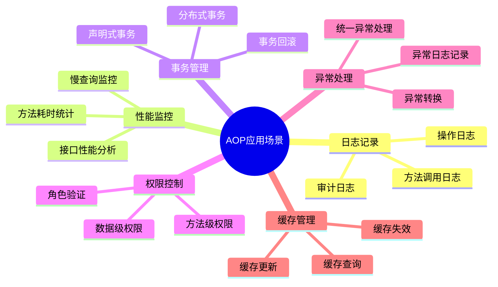

### 2. 实际案例流程

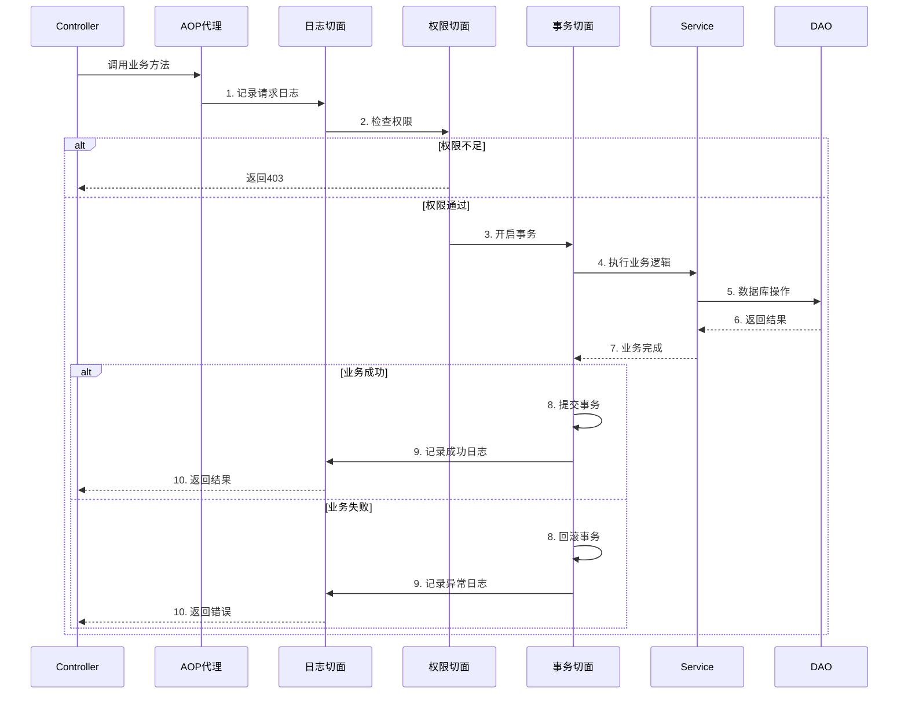

---

## 十、AOP vs 拦截器 vs 过滤器

### 1. 三者对比

| 特性       | Filter    | Interceptor  | AOP      |
| -------- | --------- | ------------ | -------- |
| **规范**   | Servlet规范 | Spring框架     | Spring框架 |
| **拦截范围** | 所有请求      | Controller请求 | 任意方法     |
| **粒度**   | 粗粒度       | 中粒度          | 细粒度      |
| **依赖**   | Servlet容器 | Spring容器     | Spring容器 |
| **执行时机** | 最早        | 中间           | 最灵活      |
| **使用场景** | 编码、跨域     | 登录、权限        | 日志、事务    |

### 2. 执行顺序图


---

## 十一、最佳实践

### 1. 切面设计原则

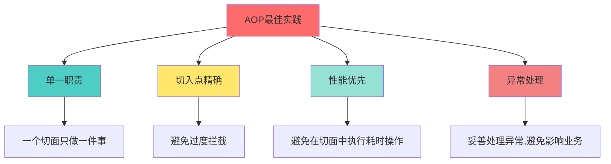

### 2. 注意事项

✅ **推荐做法：**
- 使用注解方式定义切入点
- 切面逻辑简单高效
- 合理使用通知类型
- 注意切面执行顺序（@Order）

❌ **避免做法：**
- 在切面中修改方法参数
- 切面逻辑过于复杂
- 过度使用AOP
- 忽略性能影响

---

## 十二、总结

### AOP核心价值

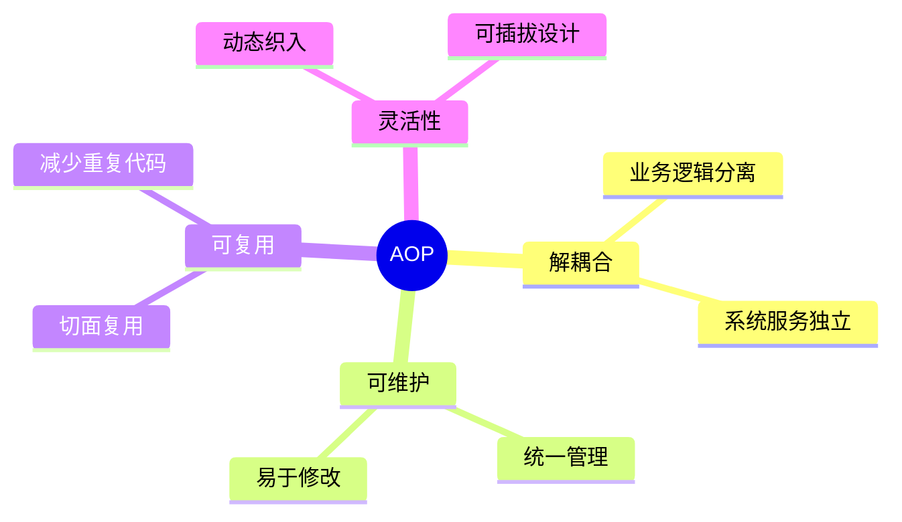

**关键要点：**
1. AOP是对OOP的补充，用于处理横切关注点
2. 通过代理模式实现方法增强
3. 五种通知类型满足不同场景需求
4. 切入点表达式灵活匹配目标方法
5. 广泛应用于日志、事务、权限等场景

希望这份详细的AOP讲解能帮助您深入理解面向切面编程！