# 拦截器（Interceptor）基础概念

## 一、说明

### 1. 什么是拦截器？

拦截器（Interceptor）是一种设计模式，用于*在方法调用前后*插入额外的处理逻辑。它可以在不修改原有代码的情况下，对请求或响应进行预处理和后处理。

### 2. 核心特点

- **非侵入性**：不需要修改原有业务代码
- **可插拔**：可以动态添加或移除拦截器
- **链式调用**：多个拦截器可以形成拦截器链
- **AOP思想**：体现了面向切面编程的理念

### 3. 主要应用场景

#### 3.1 Web开发
- 用户认证和授权
- 日志记录
- 性能监控
- 请求参数校验
- 跨域处理（CORS）
- 编码转换

#### 3.2 框架层面
- Spring MVC的HandlerInterceptor
- MyBatis的插件机制
- Struts2的拦截器

### 4. 拦截器的生命周期

```
请求到达 → preHandle() → 目标方法执行 → postHandle() → 视图渲染 → afterCompletion()
```

#### 4.1 preHandle（预处理）
- **执行时机**：在目标方法执行之前
- **返回值**：boolean类型
  - true：继续执行后续拦截器和目标方法
  - false：中断请求，不再执行后续操作
- **典型用途**：权限验证、登录检查

#### 4.2 postHandle（后处理）
- **执行时机**：目标方法执行之后，视图渲染之前
- **典型用途**：修改ModelAndView、添加公共数据

#### 4.3 afterCompletion（完成后处理）
- **执行时机**：整个请求完成之后（视图渲染完成）
- **典型用途**：资源清理、日志记录、性能统计

### 5. 拦截器 vs 过滤器（Filter）

| 特性       | 拦截器（Interceptor） | 过滤器（Filter）       |
| -------- | ---------------- | ----------------- |
| **规范**   | Spring框架提供       | Servlet规范         |
| **拦截范围** | 只拦截Controller请求  | 拦截所有请求            |
| **依赖**   | 依赖Spring容器       | 依赖Servlet容器       |
| **注入能力** | 可以注入Spring Bean  | 不能直接注入Spring Bean |
| **执行顺序** | 在Filter之后        | 在Interceptor之前    |
| **细粒度**  | 更细粒度的控制          | 粗粒度的控制            |

### 6. 代码示例（Spring MVC）

```java
@component
public class AuthInterceptor implements HandlerInterceptor {
  
    @Override
    public boolean preHandle(HttpServletRequest request, 
                           HttpServletResponse response, 
                           Object handler) throws Exception {
        // 预处理：检查用户是否登录
        String token = request.getHeader("Authorization");
      
        if (token == null || !validateToken(token)) {
            response.setStatus(HttpServletResponse.SC_UNAUTHORIZED);
            return false; // 中断请求
        }
      
        return true; // 继续执行
    }
  
    @Override
    public void postHandle(HttpServletRequest request, 
                          HttpServletResponse response, 
                          Object handler, 
                          ModelAndView modelAndView) throws Exception {
        // 后处理：添加公共数据
        if (modelAndView != null) {
            modelAndView.addObject("currentTime", System.currentTimeMillis());
        }
    }
  
    @Override
    public void afterCompletion(HttpServletRequest request, 
                               HttpServletResponse response, 
                               Object handler, 
                               Exception ex) throws Exception {
        // 完成后处理：记录日志
        long startTime = (Long) request.getAttribute("startTime");
        long endTime = System.currentTimeMillis();
        System.out.println("请求耗时：" + (endTime - startTime) + "ms");
    }
}
```

### 7. 配置拦截器

```java
@Configuration
public class WebConfig implements WebMvcConfigurer {
  
    @Override
    public void addInterceptors(InterceptorRegistry registry) {
        registry.addInterceptor(new AuthInterceptor())
                .addPathPatterns("/api/**")      // 拦截路径
                .excludePathPatterns("/api/login"); // 排除路径
    }
}
```


## 二、流程图

### 1. 拦截器基本工作流程

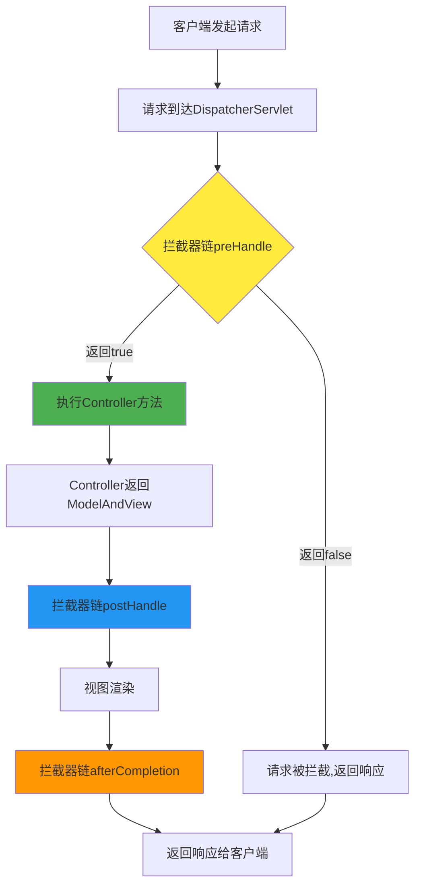

### 2. 多个拦截器执行顺序

```mermaid
graph LR
    A[请求] --> B[Interceptor1.preHandle]
    B --> C[Interceptor2.preHandle]
    C --> D[Interceptor3.preHandle]
    D --> E[Controller执行]
    E --> F[Interceptor3.postHandle]
    F --> G[Interceptor2.postHandle]
    G --> H[Interceptor1.postHandle]
    H --> I[视图渲染]
    I --> J[Interceptor3.afterCompletion]
    J --> K[Interceptor2.afterCompletion]
    K --> L[Interceptor1.afterCompletion]
    L --> M[响应]
  
    style E fill:#4caf50
    style I fill:#9c27b0
```

### 3. 拦截器链中断流程

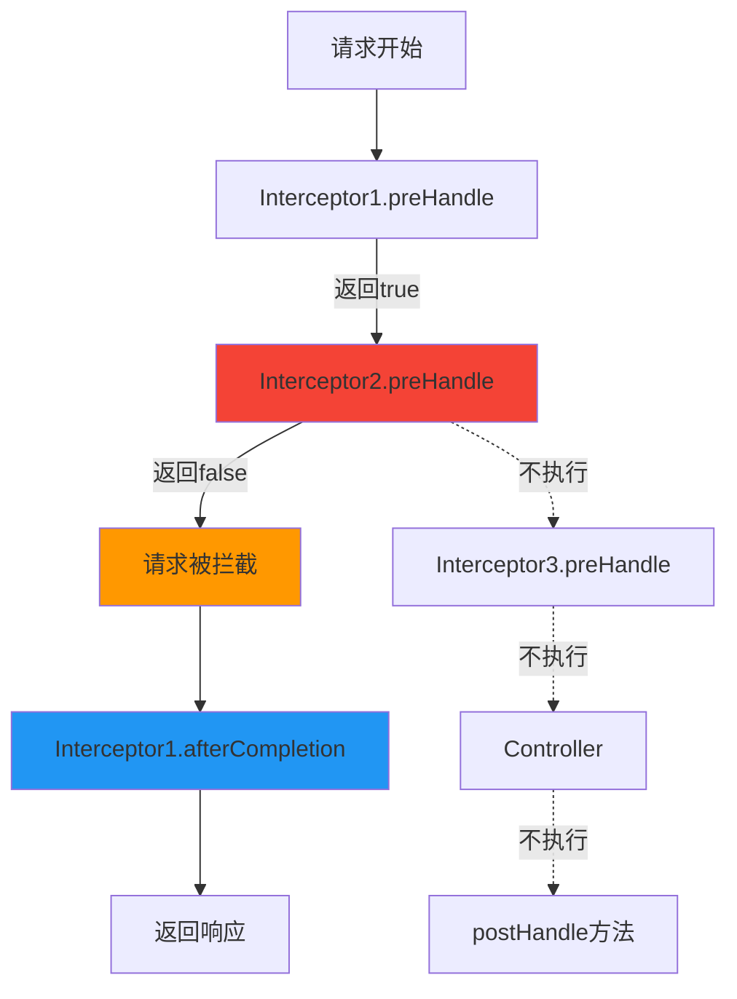

### 4. 拦截器完整生命周期

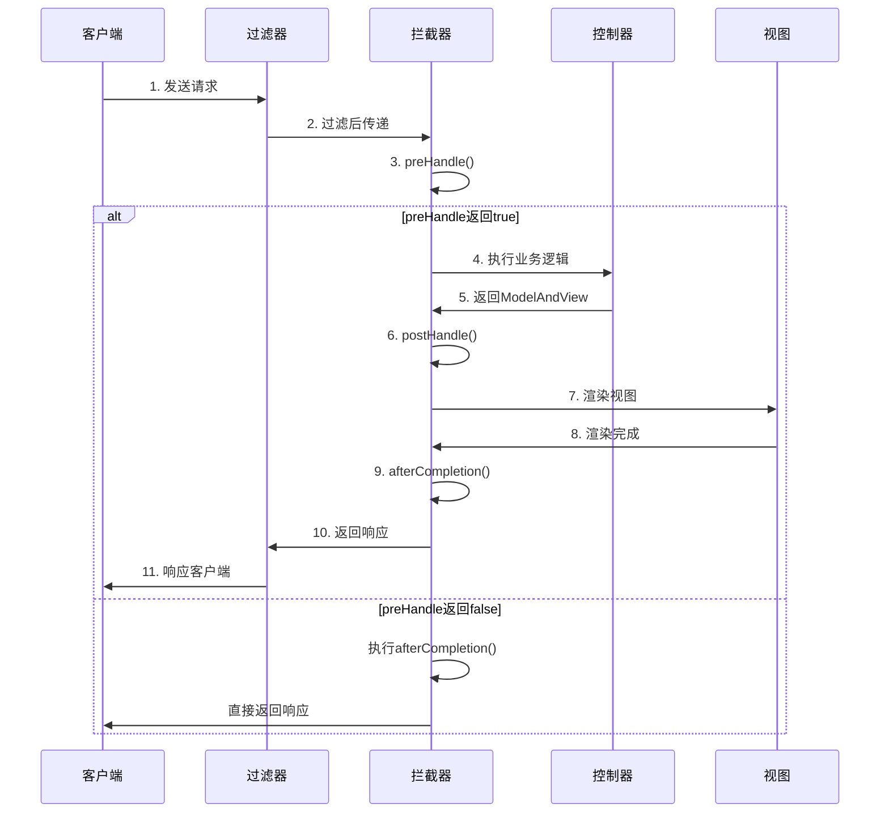

### 5. 拦截器应用架构图

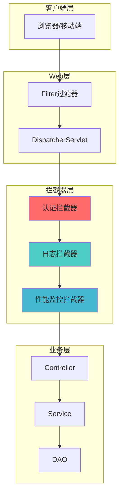


## 三、最佳实践

### 1. 设计原则
- **单一职责**：每个拦截器只负责一个功能
- **顺序合理**：认证 → 授权 → 日志 → 业务
- **性能优先**：避免在拦截器中执行耗时操作
- **异常处理**：妥善处理异常，避免影响主流程

### 2. 常见问题
- **拦截器不生效**：检查配置路径和顺序
- **循环依赖**：避免在拦截器中注入可能导致循环依赖的Bean
- **线程安全**：拦截器是单例的，注意线程安全问题

### 3. 性能优化建议
- 使用ThreadLocal存储请求级别的数据
- 避免在preHandle中进行数据库查询
- 合理使用缓存减少重复计算

---

## 总结

拦截器是后端开发中非常重要的组件，它提供了一种优雅的方式来处理横切关注点。通过合理使用拦截器，可以：

✅ 提高代码的可维护性和可扩展性
✅ 实现关注点分离，保持业务代码的纯净
✅ 统一处理通用逻辑，减少代码重复
✅ 灵活控制请求的执行流程


# 拦截器实现登录校验与令牌校验详解

## 一、业务场景说明

### 1. 为什么需要登录校验？

在实际的Web应用中，很多接口需要用户登录后才能访问，例如：
- 个人中心信息
- 订单管理
- 购物车操作
- 用户设置

**传统做法的问题：**
```java
// ❌ 在每个Controller方法中都要写重复代码
@GetMapping("/user/info")
public Result getUserInfo(HttpServletRequest request) {
    // 重复的校验逻辑
    String token = request.getHeader("Authorization");
    if (token == null || !validateToken(token)) {
        return Result.error("未登录");
    }
  
    // 业务逻辑
    return Result.success(userService.getUserInfo());
}
```

**使用拦截器的优势：**
- ✅ 统一处理，避免代码重复
- ✅ 关注点分离，业务代码更纯净
- ✅ 易于维护和修改
- ✅ 灵活配置拦截规则

---

## 二、令牌（Token）认证机制

### 1. 什么是Token？

Token（令牌）是服务器生成的一串加密字符串，用于标识用户身份。

### 2. Token认证流程

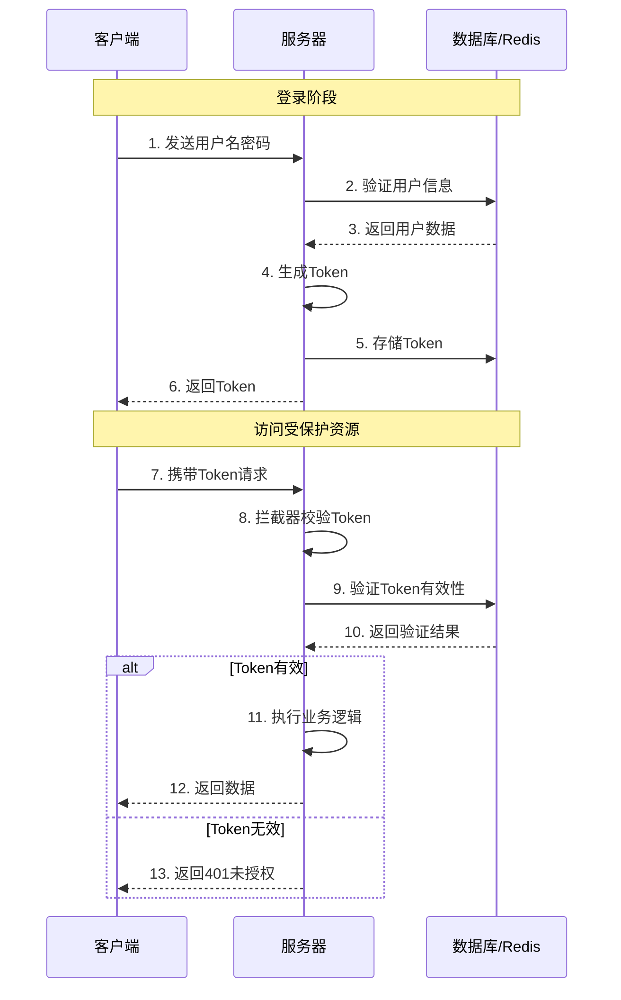

### 3. Token的类型

| 类型 | 说明 | 特点 | 适用场景 |
|------|------|------|---------|
| **UUID Token** | 随机生成的唯一字符串 | 需要服务端存储 | 传统Web应用 |
| **JWT Token** | JSON Web Token | 自包含用户信息，无需存储 | 微服务、移动端 |
| **Session Token** | 基于Session的令牌 | 依赖Cookie | 传统Web应用 |

---

## 三、完整的登录校验流程

### 1. 整体架构图

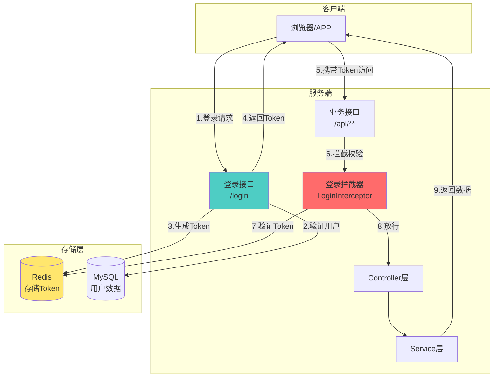

### 2. 详细流程图

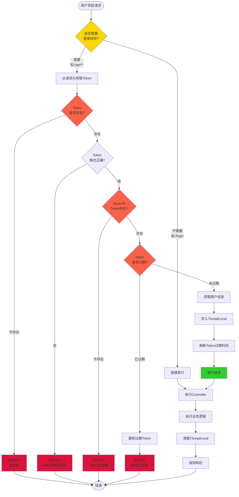

---

## 四、代码实现

### 1. 项目结构

```
com.example.demo
├── config
│   └── WebConfig.java              // 拦截器配置
├── interceptor
│   └── LoginInterceptor.java       // 登录拦截器
├── controller
│   ├── LoginController.java        // 登录控制器
│   └── UserController.java         // 业务控制器
├── service
│   └── UserService.java            // 用户服务
├── utils
│   ├── JwtUtil.java                // JWT工具类
│   ├── TokenUtil.java              // Token工具类
│   └── ThreadLocalUtil.java        // ThreadLocal工具类
└── entity
    └── User.java                   // 用户实体
```

### 2. 登录拦截器实现

```java
package com.example.demo.interceptor;

import com.example.demo.utils.JwtUtil;
import com.example.demo.utils.ThreadLocalUtil;
import lombok.extern.slf4j.Slf4j;
import org.springframework.beans.factory.annotation.Autowired;
import org.springframework.data.redis.core.StringRedisTemplate;
import org.springframework.stereotype.Component;
import org.springframework.util.StringUtils;
import org.springframework.web.servlet.HandlerInterceptor;

import javax.servlet.http.HttpServletRequest;
import javax.servlet.http.HttpServletResponse;
import java.util.Map;
import java.util.concurrent.TimeUnit;

/**
 * 登录校验拦截器
 */
@Slf4j
@Component
public class LoginInterceptor implements HandlerInterceptor {

    @Autowired
    private StringRedisTemplate redisTemplate;

    @Override
    public boolean preHandle(HttpServletRequest request, 
                           HttpServletResponse response, 
                           Object handler) throws Exception {
      
        // 1. 获取请求路径（用于日志）
        String requestURI = request.getRequestURI();
        log.info("拦截到请求: {}", requestURI);
      
        // 2. 从请求头中获取Token
        String token = request.getHeader("Authorization");
      
        // 3. 判断Token是否存在
        if (!StringUtils.hasLength(token)) {
            log.warn("Token不存在，请求路径: {}", requestURI);
            response.setStatus(HttpServletResponse.SC_UNAUTHORIZED);
            response.setContentType("application/json;charset=UTF-8");
            response.getWriter().write("{\"code\":401,\"message\":\"未登录，请先登录\"}");
            return false;
        }
      
        try {
            // 4. 验证Token格式并解析
            Map<String, Object> claims = JwtUtil.parseToken(token);
          
            // 5. 从Redis中验证Token是否存在（防止Token被盗用）
            String redisToken = redisTemplate.opsForValue().get("token:" + token);
            if (redisToken == null) {
                log.warn("Token在Redis中不存在或已过期: {}", token);
                response.setStatus(HttpServletResponse.SC_UNAUTHORIZED);
                response.setContentType("application/json;charset=UTF-8");
                response.getWriter().write("{\"code\":401,\"message\":\"登录已过期，请重新登录\"}");
                return false;
            }
          
            // 6. 将用户信息存入ThreadLocal（供后续业务使用）
            ThreadLocalUtil.set(claims);
            log.info("用户信息已存入ThreadLocal: {}", claims.get("userId"));
          
            // 7. 刷新Token过期时间（滑动过期策略）
            redisTemplate.expire("token:" + token, 30, TimeUnit.MINUTES);
          
            // 8. 放行请求
            return true;
          
        } catch (Exception e) {
            // Token解析失败
            log.error("Token解析失败: {}", e.getMessage());
            response.setStatus(HttpServletResponse.SC_UNAUTHORIZED);
            response.setContentType("application/json;charset=UTF-8");
            response.getWriter().write("{\"code\":401,\"message\":\"Token无效或已过期\"}");
            return false;
        }
    }

    @Override
    public void afterCompletion(HttpServletRequest request, 
                               HttpServletResponse response, 
                               Object handler, 
                               Exception ex) throws Exception {
        // 清理ThreadLocal，防止内存泄漏
        ThreadLocalUtil.remove();
        log.info("ThreadLocal已清理");
    }
}
```

### 3. 拦截器配置

```java
package com.example.demo.config;

import com.example.demo.interceptor.LoginInterceptor;
import org.springframework.beans.factory.annotation.Autowired;
import org.springframework.context.annotation.Configuration;
import org.springframework.web.servlet.config.annotation.InterceptorRegistry;
import org.springframework.web.servlet.config.annotation.WebMvcConfigurer;

/**
 * Web配置类 - 注册拦截器
 */
@Configuration
public class WebConfig implements WebMvcConfigurer {

    @Autowired
    private LoginInterceptor loginInterceptor;

    @Override
    public void addInterceptors(InterceptorRegistry registry) {
        registry.addInterceptor(loginInterceptor)
                // 拦截所有请求
                .addPathPatterns("/**")
                // 排除不需要登录的路径
                .excludePathPatterns(
                        "/user/login",           // 登录接口
                        "/user/register",        // 注册接口
                        "/doc.html",             // Swagger文档
                        "/swagger-resources/**", // Swagger资源
                        "/webjars/**",           // Swagger UI
                        "/v2/api-docs",          // Swagger API
                        "/error",                // 错误页面
                        "/favicon.ico",          // 网站图标
                        "/static/**"             // 静态资源
                );
    }
}
```

### 4. JWT工具类

```java
package com.example.demo.utils;

import io.jsonwebtoken.Claims;
import io.jsonwebtoken.Jwts;
import io.jsonwebtoken.SignatureAlgorithm;

import java.util.Date;
import java.util.Map;

/**
 * JWT工具类
 */
public class JwtUtil {

    // 密钥（实际项目中应该放在配置文件中）
    private static final String SECRET_KEY = "your-secret-key-must-be-very-long-and-secure";
  
    // Token有效期（毫秒）
    private static final long EXPIRATION = 1000 * 60 * 60 * 24; // 24小时

    /**
     * 生成Token
     * @param claims 用户信息
     * @return Token字符串
     */
    public static String generateToken(Map<String, Object> claims) {
        return Jwts.builder()
                .setClaims(claims)                              // 设置载荷
                .setIssuedAt(new Date())                        // 签发时间
                .setExpiration(new Date(System.currentTimeMillis() + EXPIRATION)) // 过期时间
                .signWith(SignatureAlgorithm.HS256, SECRET_KEY) // 签名算法
                .compact();
    }

    /**
     * 解析Token
     * @param token Token字符串
     * @return 用户信息
     */
    public static Claims parseToken(String token) {
        return Jwts.parser()
                .setSigningKey(SECRET_KEY)
                .parseClaimsJws(token)
                .getBody();
    }

    /**
     * 验证Token是否过期
     * @param token Token字符串
     * @return true-已过期，false-未过期
     */
    public static boolean isTokenExpired(String token) {
        try {
            Claims claims = parseToken(token);
            return claims.getExpiration().before(new Date());
        } catch (Exception e) {
            return true;
        }
    }
}
```

### 5. ThreadLocal工具类

```java
package com.example.demo.utils;

import java.util.Map;

/**
 * ThreadLocal工具类 - 存储当前登录用户信息
 */
public class ThreadLocalUtil {
  
    private static final ThreadLocal<Map<String, Object>> THREAD_LOCAL = new ThreadLocal<>();

    /**
     * 存储用户信息
     */
    public static void set(Map<String, Object> value) {
        THREAD_LOCAL.set(value);
    }

    /**
     * 获取用户信息
     */
    public static Map<String, Object> get() {
        return THREAD_LOCAL.get();
    }

    /**
     * 清除用户信息（防止内存泄漏）
     */
    public static void remove() {
        THREAD_LOCAL.remove();
    }
}
```

### 6. 登录控制器

```java
package com.example.demo.controller;

import com.example.demo.entity.User;
import com.example.demo.service.UserService;
import com.example.demo.utils.JwtUtil;
import lombok.extern.slf4j.Slf4j;
import org.springframework.beans.factory.annotation.Autowired;
import org.springframework.data.redis.core.StringRedisTemplate;
import org.springframework.web.bind.annotation.*;

import java.util.HashMap;
import java.util.Map;
import java.util.concurrent.TimeUnit;

/**
 * 登录控制器
 */
@Slf4j
@RestController
@RequestMapping("/user")
public class LoginController {

    @Autowired
    private UserService userService;

    @Autowired
    private StringRedisTemplate redisTemplate;

    /**
     * 用户登录
     */
    @PostMapping("/login")
    public Result<String> login(@RequestBody User user) {
        log.info("用户登录: {}", user.getUsername());
      
        // 1. 验证用户名密码
        User dbUser = userService.login(user.getUsername(), user.getPassword());
        if (dbUser == null) {
            return Result.error("用户名或密码错误");
        }
      
        // 2. 生成Token
        Map<String, Object> claims = new HashMap<>();
        claims.put("userId", dbUser.getId());
        claims.put("username", dbUser.getUsername());
        String token = JwtUtil.generateToken(claims);
      
        // 3. 将Token存入Redis（设置过期时间30分钟）
        redisTemplate.opsForValue().set(
            "token:" + token, 
            dbUser.getId().toString(), 
            30, 
            TimeUnit.MINUTES
        );
      
        log.info("登录成功，Token: {}", token);
        return Result.success(token);
    }

    /**
     * 用户登出
     */
    @PostMapping("/logout")
    public Result<Void> logout(@RequestHeader("Authorization") String token) {
        // 从Redis中删除Token
        redisTemplate.delete("token:" + token);
        log.info("用户登出，Token已删除");
        return Result.success();
    }
}
```

### 7. 业务控制器

```java
package com.example.demo.controller;

import com.example.demo.utils.ThreadLocalUtil;
import lombok.extern.slf4j.Slf4j;
import org.springframework.web.bind.annotation.*;

import java.util.Map;

/**
 * 用户业务控制器
 */
@Slf4j
@RestController
@RequestMapping("/api/user")
public class UserController {

    /**
     * 获取当前登录用户信息
     */
    @GetMapping("/info")
    public Result<Map<String, Object>> getUserInfo() {
        // 从ThreadLocal中获取用户信息（拦截器已存入）
        Map<String, Object> userInfo = ThreadLocalUtil.get();
        log.info("获取用户信息: {}", userInfo);
        return Result.success(userInfo);
    }

    /**
     * 修改用户信息
     */
    @PutMapping("/update")
    public Result<Void> updateUser(@RequestBody User user) {
        // 从ThreadLocal获取当前用户ID
        Map<String, Object> claims = ThreadLocalUtil.get();
        Long userId = Long.valueOf(claims.get("userId").toString());
      
        // 业务逻辑...
        log.info("用户{}修改信息", userId);
        return Result.success();
    }
}
```

---

## 五、Token存储方案对比

### 1. 存储方案对比表

| 方案         | 优点            | 缺点             | 适用场景      |
| ---------- | ------------- | -------------- | --------- |
| **Redis**  | 性能高、支持过期、易于管理 | 需要额外维护Redis    | 高并发、分布式系统 |
| **数据库**    | 持久化、数据安全      | 性能较低、增加数据库压力   | 小型系统      |
| **JWT自包含** | 无需存储、减轻服务器压力  | 无法主动失效、Token较大 | 微服务、无状态系统 |
| **内存Map**  | 实现简单          | 重启丢失、不支持分布式    | 开发测试环境    |

### 2. 推荐方案：Redis + JWT

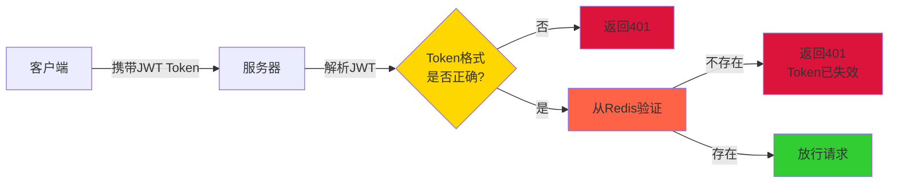

**优势：**
- JWT自包含用户信息，减少数据库查询
- Redis存储Token状态，支持主动失效
- 结合两者优点，性能和安全兼顾

---

## 六、安全增强方案

### 1. Token刷新机制

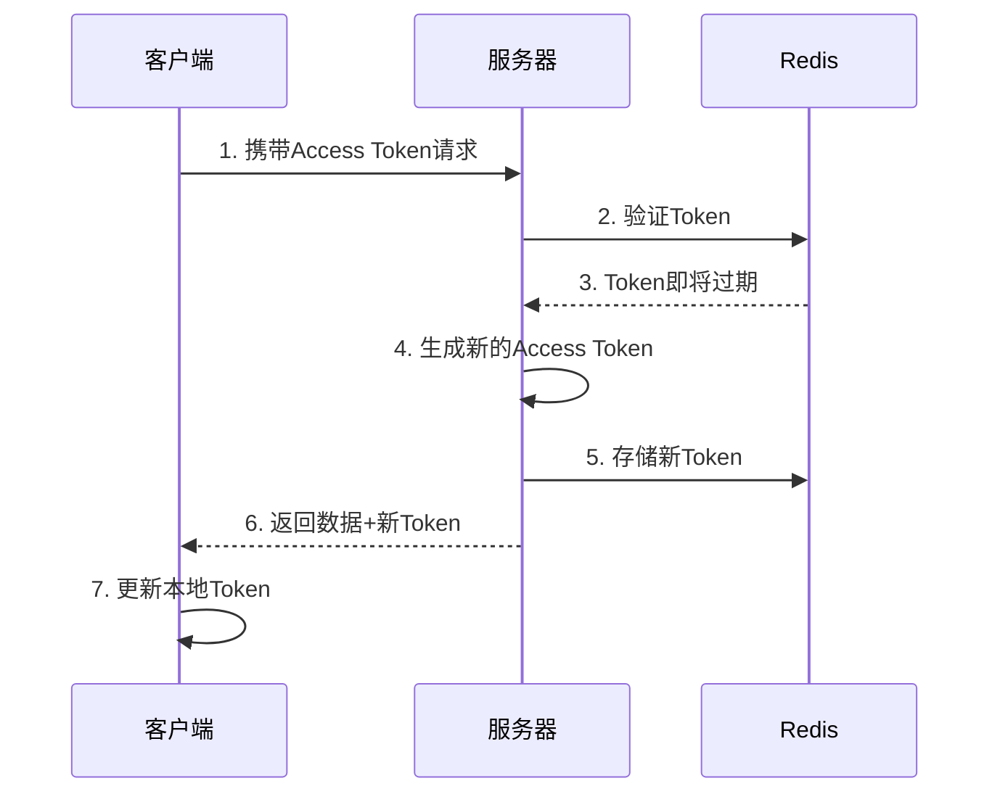

**实现代码：**

```java
@Override
public boolean preHandle(HttpServletRequest request, 
                       HttpServletResponse response, 
                       Object handler) throws Exception {
  
    String token = request.getHeader("Authorization");
  
    // 验证Token...
  
    // 检查Token剩余有效期
    Long expire = redisTemplate.getExpire("token:" + token, TimeUnit.MINUTES);
  
    // 如果剩余时间少于5分钟，自动刷新
    if (expire != null && expire < 5) {
        // 生成新Token
        Map<String, Object> claims = JwtUtil.parseToken(token);
        String newToken = JwtUtil.generateToken(claims);
      
        // 删除旧Token
        redisTemplate.delete("token:" + token);
      
        // 存储新Token
        redisTemplate.opsForValue().set(
            "token:" + newToken, 
            claims.get("userId").toString(), 
            30, 
            TimeUnit.MINUTES
        );
      
        // 在响应头中返回新Token
        response.setHeader("New-Token", newToken);
        log.info("Token已自动刷新");
    }
  
    return true;
}
```

### 2. 双Token机制（Access Token + Refresh Token）

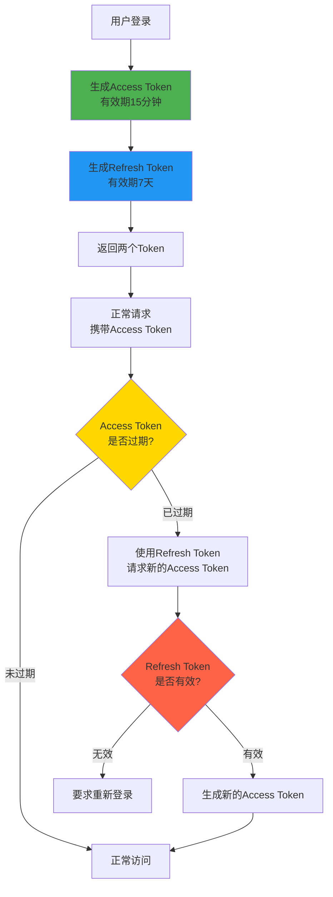

### 3. IP绑定验证

```java
@Override
public boolean preHandle(HttpServletRequest request, 
                       HttpServletResponse response, 
                       Object handler) throws Exception {
  
    String token = request.getHeader("Authorization");
    String currentIp = getClientIp(request);
  
    // 从Redis获取Token绑定的IP
    String storedIp = redisTemplate.opsForValue().get("token:ip:" + token);
  
    // 验证IP是否一致
    if (storedIp != null && !storedIp.equals(currentIp)) {
        log.warn("IP地址不匹配，可能存在Token盗用。存储IP: {}, 当前IP: {}", storedIp, currentIp);
        response.setStatus(HttpServletResponse.SC_UNAUTHORIZED);
        response.getWriter().write("{\"code\":401,\"message\":\"登录异常，请重新登录\"}");
        return false;
    }
  
    return true;
}

/**
 * 获取客户端真实IP
 */
private String getClientIp(HttpServletRequest request) {
    String ip = request.getHeader("X-Forwarded-For");
    if (ip == null || ip.isEmpty() || "unknown".equalsIgnoreCase(ip)) {
        ip = request.getHeader("X-Real-IP");
    }
    if (ip == null || ip.isEmpty() || "unknown".equalsIgnoreCase(ip)) {
        ip = request.getRemoteAddr();
    }
    return ip;
}
```

---

## 七、完整的登录校验流程图（含异常处理）

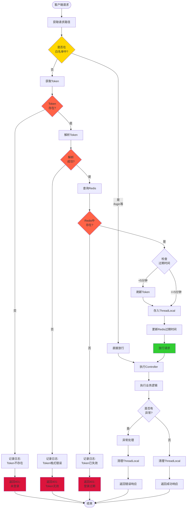

---
