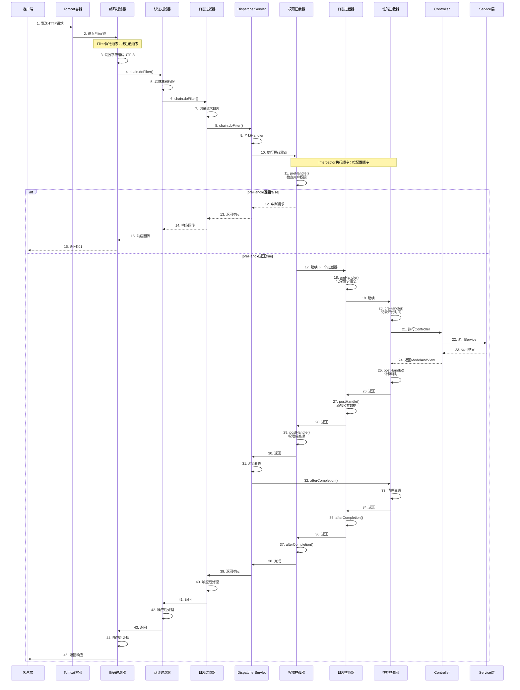
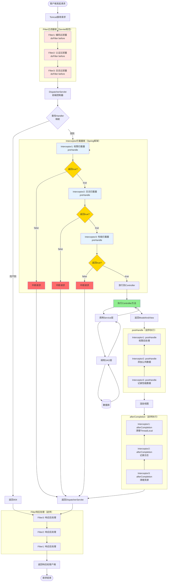
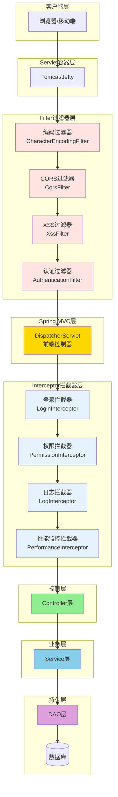
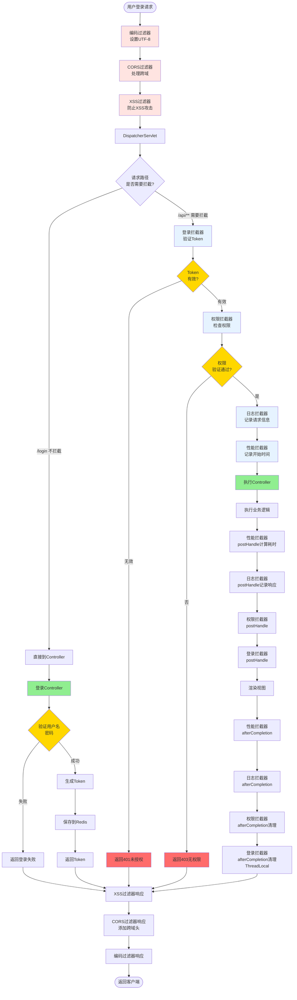

# 拦截器和过滤器同时存在的完整流程图

## 一、完整请求处理流程

```mermaid
sequenceDiagram
    participant Client as 客户端
    participant Tomcat as Tomcat容器
    participant Filter1 as 编码过滤器
    participant Filter2 as 认证过滤器
    participant Filter3 as 日志过滤器
    participant DS as DispatcherServlet
    participant Int1 as 权限拦截器
    participant Int2 as 日志拦截器
    participant Int3 as 性能拦截器
    participant Controller as Controller
    participant Service as Service层
  
    Client->>Tomcat: 1. 发送HTTP请求
    Tomcat->>Filter1: 2. 进入Filter链
  
    Note over Filter1: Filter执行顺序：按注册顺序
    Filter1->>Filter1: 3. 设置字符编码UTF-8
    Filter1->>Filter2: 4. chain.doFilter()
    Filter2->>Filter2: 5. 验证基础权限
    Filter2->>Filter3: 6. chain.doFilter()
    Filter3->>Filter3: 7. 记录请求日志
    Filter3->>DS: 8. chain.doFilter()
  
    DS->>DS: 9. 查找Handler
    DS->>Int1: 10. 执行拦截器链
  
    Note over Int1,Int3: Interceptor执行顺序：按配置顺序
    Int1->>Int1: 11. preHandle()<br/>检查用户权限
  
    alt preHandle返回false
        Int1-->>DS: 12. 中断请求
        DS-->>Filter3: 13. 返回响应
        Filter3-->>Filter2: 14. 响应回传
        Filter2-->>Filter1: 15. 响应回传
        Filter1-->>Client: 16. 返回401
    else preHandle返回true
        Int1->>Int2: 17. 继续下一个拦截器
        Int2->>Int2: 18. preHandle()<br/>记录请求信息
        Int2->>Int3: 19. 继续
        Int3->>Int3: 20. preHandle()<br/>记录开始时间
        Int3->>Controller: 21. 执行Controller
      
        Controller->>Service: 22. 调用Service
        Service-->>Controller: 23. 返回结果
        Controller-->>Int3: 24. 返回ModelAndView
      
        Int3->>Int3: 25. postHandle()<br/>计算耗时
        Int3->>Int2: 26. 返回
        Int2->>Int2: 27. postHandle()<br/>添加公共数据
        Int2->>Int1: 28. 返回
        Int1->>Int1: 29. postHandle()<br/>权限后处理
        Int1->>DS: 30. 返回
      
        DS->>DS: 31. 渲染视图
        DS->>Int3: 32. afterCompletion()
        Int3->>Int3: 33. 清理资源
        Int3->>Int2: 34. 返回
        Int2->>Int2: 35. afterCompletion()
        Int2->>Int1: 36. 返回
        Int1->>Int1: 37. afterCompletion()
        Int1->>DS: 38. 完成
      
        DS->>Filter3: 39. 返回响应
        Filter3->>Filter3: 40. 响应后处理
        Filter3->>Filter2: 41. 返回
        Filter2->>Filter2: 42. 响应后处理
        Filter2->>Filter1: 43. 返回
        Filter1->>Filter1: 44. 响应后处理
        Filter1->>Client: 45. 返回响应
    end
```

---

## 二、详细执行流程图

```mermaid
flowchart TD
    Start([客户端发起请求]) --> Tomcat[Tomcat接收请求]
  
    subgraph Filter链 ["Filter过滤器链（Servlet规范）"]
        direction TB
        F1[Filter1: 编码过滤器<br/>doFilter before]
        F2[Filter2: 认证过滤器<br/>doFilter before]
        F3[Filter3: 日志过滤器<br/>doFilter before]
        F1 --> F2 --> F3
    end
  
    Tomcat --> F1
    F3 --> DS[DispatcherServlet<br/>前端控制器]
  
    DS --> FindHandler{查找Handler<br/>映射}
    FindHandler -->|找不到| Return404[返回404]
    FindHandler -->|找到| InterceptorChain
  
    subgraph InterceptorChain ["Interceptor拦截器链（Spring框架）"]
        direction TB
        I1[Interceptor1: 权限拦截器<br/>preHandle]
        I2[Interceptor2: 日志拦截器<br/>preHandle]
        I3[Interceptor3: 性能拦截器<br/>preHandle]
        I1 --> CheckI1{返回true?}
        CheckI1 -->|false| InterceptFail1[中断请求]
        CheckI1 -->|true| I2
        I2 --> CheckI2{返回true?}
        CheckI2 -->|false| InterceptFail2[中断请求]
        CheckI2 -->|true| I3
        I3 --> CheckI3{返回true?}
        CheckI3 -->|false| InterceptFail3[中断请求]
        CheckI3 -->|true| PassToController[放行到Controller]
    end
  
    InterceptorChain --> I1
  
    PassToController --> Controller[执行Controller方法]
    Controller --> Service[调用Service层]
    Service --> DAO[调用DAO层]
    DAO --> DB[(数据库)]
    DB --> DAO
    DAO --> Service
    Service --> Controller
    Controller --> ReturnMV[返回ModelAndView]
  
    ReturnMV --> PostHandle
    subgraph PostHandle ["postHandle（逆序执行）"]
        direction BT
        PH3[Interceptor3: postHandle<br/>记录性能数据]
        PH2[Interceptor2: postHandle<br/>添加公共数据]
        PH1[Interceptor1: postHandle<br/>权限后处理]
        PH3 --> PH2 --> PH1
    end
  
    PostHandle --> RenderView[渲染视图]
    RenderView --> AfterCompletion
  
    subgraph AfterCompletion ["afterCompletion（逆序执行）"]
        direction BT
        AC3[Interceptor3: afterCompletion<br/>清理资源]
        AC2[Interceptor2: afterCompletion<br/>记录日志]
        AC1[Interceptor1: afterCompletion<br/>清理ThreadLocal]
        AC3 --> AC2 --> AC1
    end
  
    AfterCompletion --> BackToDS[返回DispatcherServlet]
  
    subgraph FilterResponse ["Filter响应处理（逆序）"]
        direction BT
        FR3[Filter3: 响应后处理]
        FR2[Filter2: 响应后处理]
        FR1[Filter1: 响应后处理]
        FR3 --> FR2 --> FR1
    end
  
    BackToDS --> FR3
    InterceptFail1 --> BackToDS
    InterceptFail2 --> BackToDS
    InterceptFail3 --> BackToDS
    Return404 --> FR3
  
    FR1 --> Response[返回响应给客户端]
    Response --> End([请求结束])
  
    style F1 fill:#FFE4E1
    style F2 fill:#FFE4E1
    style F3 fill:#FFE4E1
    style I1 fill:#E6F3FF
    style I2 fill:#E6F3FF
    style I3 fill:#E6F3FF
    style Controller fill:#90EE90
    style CheckI1 fill:#FFD700
    style CheckI2 fill:#FFD700
    style CheckI3 fill:#FFD700
    style InterceptFail1 fill:#FF6B6B
    style InterceptFail2 fill:#FF6B6B
    style InterceptFail3 fill:#FF6B6B
```

---

## 三、执行顺序对比图

```mermaid
graph LR
    subgraph 请求阶段
        direction LR
        A1[Filter1 before] --> A2[Filter2 before]
        A2 --> A3[Filter3 before]
        A3 --> A4[DispatcherServlet]
        A4 --> A5[Interceptor1 pre]
        A5 --> A6[Interceptor2 pre]
        A6 --> A7[Interceptor3 pre]
        A7 --> A8[Controller]
    end
  
    subgraph 响应阶段
        direction RL
        B8[Controller] --> B7[Interceptor3 post]
        B7 --> B6[Interceptor2 post]
        B6 --> B5[Interceptor1 post]
        B5 --> B4[View Render]
        B4 --> B3[Interceptor3 after]
        B3 --> B2[Interceptor2 after]
        B2 --> B1[Interceptor1 after]
        B1 --> B0[DispatcherServlet]
        B0 --> B-1[Filter3 after]
        B-1 --> B-2[Filter2 after]
        B-2 --> B-3[Filter1 after]
    end
  
    A8 --> B8
  
    style A1 fill:#FFB6C1
    style A2 fill:#FFB6C1
    style A3 fill:#FFB6C1
    style A5 fill:#87CEEB
    style A6 fill:#87CEEB
    style A7 fill:#87CEEB
    style A8 fill:#90EE90
    style B8 fill:#90EE90
    style B7 fill:#87CEEB
    style B6 fill:#87CEEB
    style B5 fill:#87CEEB
    style B-1 fill:#FFB6C1
    style B-2 fill:#FFB6C1
    style B-3 fill:#FFB6C1
```

---

## 四、层次架构图

```mermaid
graph TB
    subgraph 客户端层
        Client[浏览器/移动端]
    end
  
    subgraph Servlet容器层
        Tomcat[Tomcat/Jetty]
    end
  
    subgraph Filter过滤器层
        F1[编码过滤器<br/>CharacterEncodingFilter]
        F2[CORS过滤器<br/>CorsFilter]
        F3[XSS过滤器<br/>XssFilter]
        F4[认证过滤器<br/>AuthenticationFilter]
    end
  
    subgraph Spring MVC层
        DS[DispatcherServlet<br/>前端控制器]
    end
  
    subgraph Interceptor拦截器层
        I1[登录拦截器<br/>LoginInterceptor]
        I2[权限拦截器<br/>PermissionInterceptor]
        I3[日志拦截器<br/>LogInterceptor]
        I4[性能监控拦截器<br/>PerformanceInterceptor]
    end
  
    subgraph 控制层
        Controller[Controller层]
    end
  
    subgraph 业务层
        Service[Service层]
    end
  
    subgraph 持久层
        DAO[DAO层]
        DB[(数据库)]
    end
  
    Client --> Tomcat
    Tomcat --> F1
    F1 --> F2
    F2 --> F3
    F3 --> F4
    F4 --> DS
    DS --> I1
    I1 --> I2
    I2 --> I3
    I3 --> I4
    I4 --> Controller
    Controller --> Service
    Service --> DAO
    DAO --> DB
  
    style F1 fill:#FFE4E1
    style F2 fill:#FFE4E1
    style F3 fill:#FFE4E1
    style F4 fill:#FFE4E1
    style DS fill:#FFD700
    style I1 fill:#E6F3FF
    style I2 fill:#E6F3FF
    style I3 fill:#E6F3FF
    style I4 fill:#E6F3FF
    style Controller fill:#90EE90
    style Service fill:#87CEEB
    style DAO fill:#DDA0DD
```

---

## 五、实际应用场景流程

```mermaid
flowchart TD
    Start([用户登录请求]) --> F1[编码过滤器<br/>设置UTF-8]
    F1 --> F2[CORS过滤器<br/>处理跨域]
    F2 --> F3[XSS过滤器<br/>防止XSS攻击]
    F3 --> DS[DispatcherServlet]
  
    DS --> CheckPath{请求路径<br/>是否需要拦截?}
    CheckPath -->|/login 不拦截| DirectController[直接到Controller]
    CheckPath -->|/api/** 需要拦截| I1
  
    I1[登录拦截器<br/>验证Token] --> TokenValid{Token<br/>有效?}
    TokenValid -->|无效| Return401[返回401未授权]
    TokenValid -->|有效| I2[权限拦截器<br/>检查权限]
  
    I2 --> PermValid{权限<br/>验证通过?}
    PermValid -->|否| Return403[返回403无权限]
    PermValid -->|是| I3[日志拦截器<br/>记录请求信息]
  
    I3 --> I4[性能拦截器<br/>记录开始时间]
    I4 --> Controller[执行Controller]
  
    DirectController --> LoginController[登录Controller]
    LoginController --> ValidateUser{验证用户名<br/>密码}
    ValidateUser -->|失败| ReturnError[返回登录失败]
    ValidateUser -->|成功| GenerateToken[生成Token]
    GenerateToken --> SaveRedis[保存到Redis]
    SaveRedis --> ReturnToken[返回Token]
  
    Controller --> BusinessLogic[执行业务逻辑]
    BusinessLogic --> I4Post[性能拦截器<br/>postHandle计算耗时]
    I4Post --> I3Post[日志拦截器<br/>postHandle记录响应]
    I3Post --> I2Post[权限拦截器<br/>postHandle]
    I2Post --> I1Post[登录拦截器<br/>postHandle]
  
    I1Post --> RenderView[渲染视图]
    RenderView --> I4After[性能拦截器<br/>afterCompletion]
    I4After --> I3After[日志拦截器<br/>afterCompletion]
    I3After --> I2After[权限拦截器<br/>afterCompletion清理]
    I2After --> I1After[登录拦截器<br/>afterCompletion清理ThreadLocal]
  
    I1After --> F3Response[XSS过滤器响应]
    Return401 --> F3Response
    Return403 --> F3Response
    ReturnToken --> F3Response
    ReturnError --> F3Response
  
    F3Response --> F2Response[CORS过滤器响应<br/>添加跨域头]
    F2Response --> F1Response[编码过滤器响应]
    F1Response --> End([返回客户端])
  
    style F1 fill:#FFE4E1
    style F2 fill:#FFE4E1
    style F3 fill:#FFE4E1
    style I1 fill:#E6F3FF
    style I2 fill:#E6F3FF
    style I3 fill:#E6F3FF
    style I4 fill:#E6F3FF
    style TokenValid fill:#FFD700
    style PermValid fill:#FFD700
    style ValidateUser fill:#FFD700
    style Return401 fill:#FF6B6B
    style Return403 fill:#FF6B6B
    style Controller fill:#90EE90
    style LoginController fill:#90EE90
```

---

## 六、时间轴执行图

```mermaid
gantt
    title Filter和Interceptor执行时间轴
    dateFormat X
    axisFormat %L ms
  
    section Filter层
    编码过滤器 before    :f1, 0, 2
    CORS过滤器 before    :f2, 2, 4
    日志过滤器 before    :f3, 4, 6
    日志过滤器 after     :f3a, 96, 98
    CORS过滤器 after     :f2a, 98, 100
    编码过滤器 after     :f1a, 100, 102
  
    section Spring MVC
    DispatcherServlet   :ds, 6, 10
    查找Handler         :handler, 10, 12
    视图渲染            :view, 80, 90
    返回响应            :resp, 90, 96
  
    section Interceptor层
    登录拦截器 preHandle      :i1, 12, 18
    权限拦截器 preHandle      :i2, 18, 24
    日志拦截器 preHandle      :i3, 24, 28
    性能拦截器 preHandle      :i4, 28, 30
    性能拦截器 postHandle     :i4p, 60, 62
    日志拦截器 postHandle     :i3p, 62, 64
    权限拦截器 postHandle     :i2p, 64, 66
    登录拦截器 postHandle     :i1p, 66, 68
    性能拦截器 afterCompletion :i4a, 68, 72
    日志拦截器 afterCompletion :i3a, 72, 74
    权限拦截器 afterCompletion :i2a, 74, 76
    登录拦截器 afterCompletion :i1a, 76, 80
  
    section 业务层
    Controller执行      :ctrl, 30, 40
    Service执行         :svc, 40, 55
    DAO执行            :dao, 55, 60
```

---
